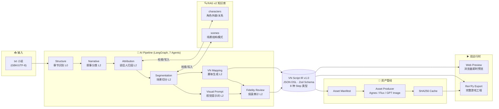
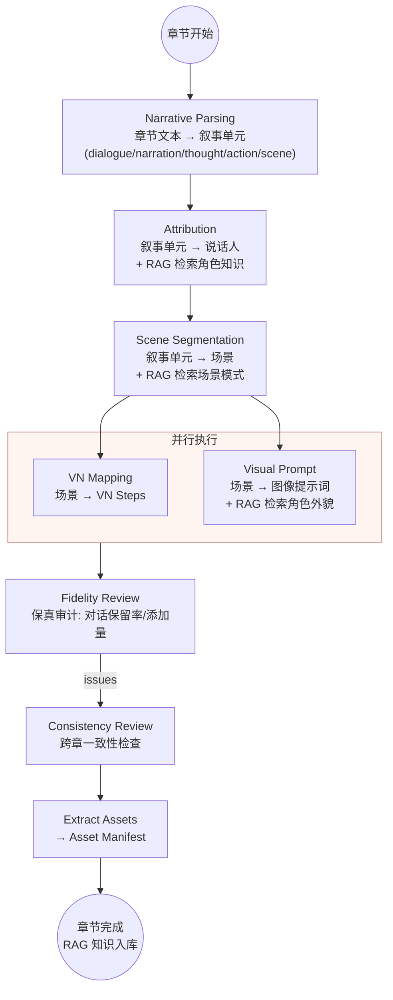
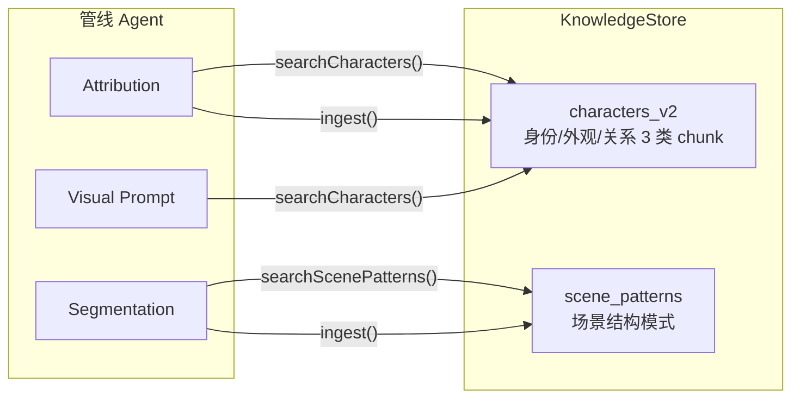
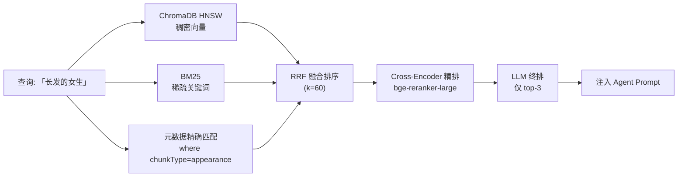

<div align="center">

# All Novel Can Be Galgame

**将中文恋爱向 txt 小说一键转化为可玩视觉小说 (Galgame) 的本地 AI 工作台**

RAG 驱动的长文本知识管理 —— ChromaDB 向量存储 · 多路召回 · Cross-Encoder 精排 · 层次化分块

[](https://github.com/lin1753/novel2galgame)
[](LICENSE)
[](https://github.com/lin1753/novel2galgame/pulls)

[](https://www.typescriptlang.org/)
[](https://react.dev/)
[](https://nodejs.org/)
[](https://github.com/langchain-ai/langgraph)
[](https://huggingface.co/mikuhhn1239)

**[功能特性](#-功能特性) · [系统架构](#️-系统架构) · [快速开始](#-快速开始) · [文档](#-文档)**

</div>

---

## 📖 简介

百万字的恋爱小说塞不进 LLM 的上下文窗口？**All Novel Can Be Galgame** 用一条 7-Agent 管线 + RAG 长文本知识库解决这个问题:上传 txt 小说,自动解析章节、归因说话人、切分场景、生成 VN 脚本,最终导出为可直接游玩的 Ren'Py 游戏。

```text
上传小说 ──▶ AI 管线自动处理 ──▶ 工作台预览微调 ──▶ 导出 Ren'Py 游玩
```

它是**叙事转换器**而非改写工具:对话保留率 ≥95%,非原文添加 ≤5%,忠实保留原文情节、人物关系与情感基调。

## ✨ 功能特性

- **一键转换** —— 上传 GBK/UTF-8 txt,自动检测编码、识别章节(90 章小说 F1 ≥ 0.95)、全流程免值守
- **RAG 跨章一致性** —— 角色外貌/关系/场景结构知识随管线增量入库,第 89 章的角色立绘依然和第 1 章一致
- **双运行时同源** —— VN Script IR 作为唯一中间表示,Web 预览与 Ren'Py 导出共享同一份数据
- **完整资产管线** —— 从脚本提取资产清单 → AI 生成背景/立绘(含表情差分)→ SHA256 缓存 → 打包导出
- **断点续跑** —— LangGraph checkpoint + SHA256 缓存,省 80% API 调用,崩溃后从断点恢复
- **本地模型支持** —— Qwen3-8B SFT + 3 个 LoRA adapter,前 3 个 Agent 可跑在本地 GPU,其余走云端
- **可视化工作台** —— 15 个页面的 React SPA:章节管理、场景编辑、VN 预览、资产管理、RAG 检查器

## 🏗️ 系统架构



**核心设计原则:**

| 原则 | 说明 |
|------|------|
| IR 是唯一中间表示 | 所有 Agent 只输出 VN Script IR,不生成任何引擎特定格式 |
| IR v1.0 冻结 | 8 种 step 类型不可增删,新增字段需版本升级;Zod schema 为权威定义 |
| Runtime 与 Export 分离 | 新增导出目标(Godot/HTML)只需新 Exporter,管线零改动 |
| RAG 项目隔离 | 所有消费者强制 `projectId` 过滤,防止跨项目数据污染 |

## 🔁 核心管线

每章依次经过 7 个 Agent,LangGraph StateGraph 编排,支持 checkpoint 断点续跑:



每个 Agent 处理时**实时检索**前序章节知识,完成后**增量写入**新知识 —— 知识库随管线推进生长:



## 🔍 RAG 知识检索

面向 90 章百万字长篇小说的跨章节知识管理:



### 检索技术栈

| 组件 | 选型 |
|------|------|
| 向量存储 | ChromaDB HNSW 索引 |
| 嵌入 | bge-small-zh-v1.5 (512-dim) CPU 推理 |
| 多路召回 | 稠密向量 + 稀疏 BM25 + 元数据精确匹配 → RRF 融合 |
| 精排 | Cross-Encoder → LLM 终排 |
| 分块 | 层次化分块 (6 种子块类型 + 父文档召回) |
| 过滤 | 元数据过滤 ($lte/$ne 时序约束防标签泄露) |

### 评测结果

| 指标 | 数值 | 说明 |
|------|------|------|
| Hit@1 | 70.0% | 30 条查询 |
| Hit@5 | 90.0% | 含 3 条边界查询 |
| MRR | 0.7678 | Mean Reciprocal Rank |
| 场景切分 | 73%(+7%) | 管线 A/B 对比,RAG 注入带来提升 |
| 消融实验 | keyword vs bigram | MRR 0.7678 vs 0.7733 |

## 🧩 VN Script IR v1.0

所有 Agent 的唯一输出契约,8 种 step 类型(冻结):

```typescript
type VNStep =
  | { type: "bg";         backgroundId: string; backgroundLabel?: string }
  | { type: "show";       characterId: string; expression?: string;
                         position?: "left_far" | "left" | "center" | "right" | "right_far" }
  | { type: "hide";       characterId: string }
  | { type: "narration";  text: string }
  | { type: "say";        characterId: string; displayName: string; text: string }
  | { type: "thought";    characterId: string; displayName: string; text: string }
  | { type: "pause";      durationMs: number }
  | { type: "transition"; name: "fade" | "cut" | "dissolve" }
```

## 📦 Monorepo 结构

```text
apps/
  api/          Node.js REST API (Express + SQLite, 端口 3002)
  workbench/    React 19 SPA 工作台 (Vite 6 + Tailwind 4, 端口 5173)
packages/
  pipeline/     LangGraph StateGraph 编排 + checkpoint 断点续跑
  core/         领域模型与 TypeScript 接口
  agents/       7 个 AI Agent 实现
  ir/           VN Script IR v1.0 Zod Schema (权威定义)
  rag/          RAG v2 知识检索 (ChromaDB + 多路召回 + 评测)
  providers/    LLM + 图像 + 视频 Provider 抽象层
  asset/        资产管线 (manifest → 生成 → 缓存 → 导出)
  storage/      SQLite 索引 + 文件系统存储
  export/       Ren'Py Builder
  runtime/      Web VN 播放引擎
  evaluation/   评测框架
docs/           设计文档 + 训练日志 + 模型卡 + 审计报告
data/           项目数据、测试小说、评测数据集
xl/             训练代码、数据集、评测结果
```

## 🚀 快速开始

**前置要求:** Node.js ≥ 20, pnpm ≥ 9

```bash
# 1. 克隆并安装依赖
git clone https://github.com/lin1753/novel2galgame.git
cd novel2galgame
pnpm install

# 2. 启动 (方式一: 一键启动前后端)
pnpm dev

# 2. 启动 (方式二: 分开启动,便于调试)
cd apps/api && npx tsx watch src/index.ts        # API → http://localhost:3002
cd apps/workbench && npx vite                    # 前端 → http://localhost:5173
```

打开 `http://localhost:5173`,新建项目 → 上传 txt → 在「模型配置」页填入任一 OpenAI 兼容 API Key → 运行管线。

<details>
<summary><b>🤖 可选: 部署本地 SFT 模型</b></summary>

```bash
pip install huggingface_hub
python scripts/download-models.py    # 下载基座 16GB + 3 个 LoRA
python scripts/serve-sft.py          # OpenAI 兼容 API → http://localhost:8000/v1
```

管线运行时通过 `localBaseUrl` 参数路由,前 3 个 Agent 走本地模型,其余走云端。

</details>

## 🖥️ 工作台页面

| 路由 | 页面 | 功能 |
|------|------|------|
| `/` | 项目列表 | 项目卡片管理 |
| `/projects/new` | 新建项目 | 3 步向导 |
| `/config` | 模型配置 | Profile 添加/切换/连接测试 |
| `/projects/:id/overview` | 项目总览 | 章节进度统计 |
| `/projects/:id/chapters` | 章节管理 | 批量运行/暂停/重试 |
| `/projects/:id/scenes` | 场景工作区 | 原文/解析/归因/脚本 4 Tab |
| `/projects/:id/editor` | 场景编辑器 | VN Step 拖拽编辑 |
| `/projects/:id/preview` | VN 预览 | 浏览器内播放(自动/手动推进) |
| `/projects/:id/prompts` | 视觉提示词 | 角色/背景提示词编辑 |
| `/projects/:id/assets` | 资产管理 | 背景/立绘生成与重生成 |
| `/projects/:id/rag` | RAG 检查器 | 知识库 chunk 浏览与检索测试 |
| `/projects/:id/script` | VN 脚本 | 原始 IR 查看 |
| `/projects/:id/tasks` | 任务日志 | 管线任务状态追踪 |
| `/projects/:id/settings` | 项目设置 | 项目元数据/删除 |

<details>
<summary><b>🔌 API 示例</b></summary>

```bash
# 创建项目 + 导入小说
curl -X POST http://localhost:3002/projects -d '{"title":"我的小说"}'
curl -X POST http://localhost:3002/projects/{id}/import -F "file=@novel.txt"

# 运行单章管线 (云端模型)
curl -X POST http://localhost:3002/projects/{id}/chapters/{chapterId}/run \
  -d '{"model":"agnes-2.0-flash"}'

# 运行单章管线 (本地 SFT + 云端混合)
curl -X POST http://localhost:3002/projects/{id}/chapters/{chapterId}/run \
  -d '{"model":"agnes-2.0-flash","localBaseUrl":"http://localhost:8000/v1"}'

# 一键导出 Ren'Py (管线 + 导出 + 资产全自动)
curl -X POST http://localhost:3002/projects/{id}/auto-export \
  -d '{"model":"agnes-2.0-flash","maxChapters":10}'

# 图像 / 视频生成
curl -X POST http://localhost:3002/images/generate -d '{"prompt":"anime style schoolgirl"}'
curl -X POST http://localhost:3002/videos/generate -d '{"prompt":"sunset beach scene"}'
```

</details>

## ☁️ 云端模型

| 模型 | 用途 | 价格 |
|------|------|------|
| Agnes AI `agnes-2.0-flash` | LLM 推理 | 免费 |
| Agnes AI `agnes-image-2.1-flash` | 文生图 | 免费 |
| Agnes AI `agnes-video-v2.0` | 文生视频/图生视频 | 免费 |

兼容任何 OpenAI 兼容 API(DeepSeek、Moonshot、智谱、本地 Ollama 等),在工作台「模型配置」页切换。

## 🤖 本地模型 (Qwen3-8B SFT)

基于 Qwen3-8B-Instruct 全参微调,669 本中文网络小说训练(约 7200 万字符),3 个 LoRA adapter 执行专项任务:

| 模型 | 任务 | 指标 |
|------|------|------|
| [qwen3-8b-novel-base-sft](https://huggingface.co/mikuhhn1239/qwen3-8b-novel-base-sft) | 小说叙事风格基座 | — |
| [qwen3-8b-narrative-parsing-lora](https://huggingface.co/mikuhhn1239/qwen3-8b-narrative-parsing-lora) | 叙事单元分类 | 72.8% |
| [qwen3-8b-attribution-assist-lora](https://huggingface.co/mikuhhn1239/qwen3-8b-attribution-assist-lora) | 角色归因 | 86.7% |
| [qwen3-8b-scene-segmentation-lora](https://huggingface.co/mikuhhn1239/qwen3-8b-scene-segmentation-lora) | 场景边界检测 | 30.5% F1 |

**训练硬件:** 8× NVIDIA A800-80GB | **方法:** LoRA r=64 α=128 | **详细:** [model_cards.md](docs/model_cards.md) · [TRAINING_LOG.md](docs/TRAINING_LOG.md)

## 📊 质量与评测

**验收指标:**

| Agent | 指标 | 目标 |
|-------|------|------|
| Structure | 章节识别 F1 | ≥ 0.95 |
| Narrative Parsing | 宏 F1 | ≥ 0.86 |
| Attribution | 说话人归属准确率 | ≥ 0.87 |
| Scene Segmentation | 边界 F1 | ≥ 0.78 |
| VN Mapping | 对话保留率 / 非原文添加 | ≥ 95% / ≤ 5% |
| Fidelity Review | 严重问题召回率 | ≥ 0.92 |
| 系统 | 章节完成率 / 预览可用率 | ≥ 85% / ≥ 90% |

**质量审计:** 2026-08-16 完成全量代码审计(12 packages + 2 apps,~22,000 LOC),3 轮审查修复 ~60 处隐形 bug(RAG 跨项目隔离、管线状态管理、Ren'Py 导出崩溃等)。详见 [PROGRESS.md](PROGRESS.md) Phase 10。

## 🗺️ 路线图

- [x] Phase 1-4 文本主链路 + 工作台 + 预览播放 + 评测框架
- [x] Phase 5-6 管线测试 + Ren'Py 导出产品闭环
- [x] Phase 7-8 IR v1.0 冻结 + 资产管线 + 章节并行 + 全链路贯通
- [x] Phase 9 RAG v2 全链路 + 角色一致性修复
- [x] Phase 10 全量代码质量审计(~60 bug 修复)
- [ ] v1.0 可视化编辑器(AI 80% + 人工 20%)+ 更多导出目标(Godot/HTML)

## 📚 文档

| 文档 | 内容 |
|------|------|
| [PROGRESS.md](PROGRESS.md) | Phase 1-10 完整开发记录 |
| [CONTRIBUTING.md](CONTRIBUTING.md) | 贡献指南 |
| [INTERVIEW_PREP.md](INTERVIEW_PREP.md) | RAG 系统设计深度讲解 |
| [docs/model_cards.md](docs/model_cards.md) | LoRA 模型卡 |
| [docs/](docs/) | 10 份设计文档 + 审计报告 |

## 🤝 贡献

欢迎 PR!修 bug、提 feature、优化文档都可以 —— 详见 [CONTRIBUTING.md](CONTRIBUTING.md)。

## License

Apache 2.0 — 详见 [LICENSE](LICENSE)
