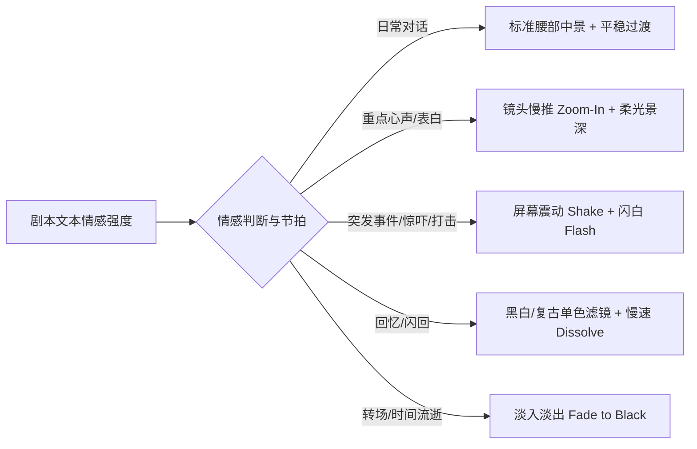

# Galgame 行业制作规范与舞台演出设计指南

> **文档定位**：汇集 Galgame（视觉小说/Visual Novel）行业标准制作流程、角色创作与立绘规范、分镜景别、舞台编排与调度（Staging & Blocking）、影视化镜头语言（Cinematography）及 Ren'Py / Web 引擎技术实现标准，作为《All Novel Can Be Galgame》管线升级与演算法设计的权威参考规范。

---

## 目录

1. [Galgame 演出设计核心理念：从“幻灯片”到“视听电影”](#一galgame-演出设计核心理念)
2. [角色设计与立绘工业化制作规范](#二角色设计与立绘工业化制作规范)
   - 2.1 [立绘透明通道与格式标准](#21-立绘透明通道与格式标准)
   - 2.2 [五级景别体系 (Shot Size Hierarchy)](#22-五级景别体系-shot-size-hierarchy)
   - 2.3 [情绪表情差分系统 (Expression Matrix)](#23-情绪表情差分系统-expression-matrix)
   - 2.4 [姿态与视线朝向 (Poses & Eye Contact)](#24-姿态与视线朝向-poses--eye-contact)
3. [舞台编排与空间调度 (Staging & Blocking)](#三舞台编排与空间调度-staging--blocking)
   - 3.1 [角色站位与 180 度轴线原则](#31-角色站位与-180-度轴线原则)
   - 3.2 [空间深度与多角色层级 (Z-Depth & Parallax)](#32-空间深度与多角色层级-z-depth--parallax)
   - 3.3 [动态出入场与走位轨迹](#33-动态出入场与走位轨迹)
4. [镜头语言与视听通感 (Cinematography & Visual Effects)](#四镜头语言与视听通感-cinematography--visual-effects)
   - 4.1 [摄像机运镜 (Camera Motion: Zoom / Pan / Shake)](#41-摄像机运镜-camera-motion-zoom--pan--shake)
   - 4.2 [转场与氛围过渡 (Transitions & Atmospheric Effects)](#42-转场与氛围过渡-transitions--atmospheric-effects)
   - 4.3 [心理活动与重点剧情的“仪式感演出”](#43-心理活动与重点剧情的仪式感演出)
5. [技术实现标准：Ren'Py ATL 与 Web 播放引擎契合](#五技术实现标准renpy-atl-与-web-播放引擎契合)
   - 5.1 [Ren'Py ATL (Animation & Transformation Language) 规范](#51-renpy-atl-规范)
   - 5.2 [Web Runtime 动态渲染与 CSS 动画规范](#52-web-runtime-动态渲染与-css-动画规范)
6. [在《All Novel Can Be Galgame》中的工程落地映射](#六在-all-novel-can-be-galgame-中的工程落地映射)

---

## 一、Galgame 演出设计核心理念

传统低质量视觉小说常陷入**“背景图 + 静态立绘 + 底部文本框”**的三件套幻灯片模式，玩家极易产生视觉疲劳。

优秀的 Galgame 演出（如《魔法使之夜》、《Clannad》、《White Album 2》、《Steins;Gate》）的核心在于：**“在有限的 2D 素材下，通过视听节奏、镜头推拉、空间调度与光影氛围的精细拼贴，构建出超越静态立绘的电影级叙事沉浸感。”**

Galgame 演出三大支柱：
1. **视线聚焦（Focus & Eye Direction）**：让玩家的第一视线始终与当前情节的情绪焦点同步（通过景别推近、高亮或移动实现）；
2. **空间呼吸感（Spatial Breathing）**：角色不是贴在背景上的纸片，而是处于具备纵深、前后遮挡、光影交融的三维舞台中；
3. **情绪同步（Emotional Resonance）**：紧张时震屏与镜头速推，犹豫时角色微移与视线偏转，温情时微距特写与柔光转场。

---

## 二、角色设计与立绘工业化制作规范

### 2.1 立绘透明通道与格式标准
- **强制透明背景 (Alpha Channel)**：立绘必须为 **32-bit RGBA Transparent PNG** 或 WebP，严禁带任何白底、黑底或抠图毛边（Alpha Mask Feathering 必须平滑）。
- **分辨率基准**：
  - 导出画质基准：`1080p` 游戏标准立绘高度建议在 `1200px ~ 1800px` 之间（为镜头放大提供无损缩放空间）。
  - 宽高比：推荐 `3:4` 或 `9:16` 竖构图。

### 2.2 五级景别体系 (Shot Size Hierarchy)

在 Galgame 实际制作中，绝大多数日常剧情**不是使用全身像**，而是以**腰部中景与胸像近景**为主力：

```
+-------------------------------------------------------------+
| 景别名称       | 画面截取范围         | 适用剧情与心理距离          |
+-------------------------------------------------------------+
| Close-Up (特写)| 头顶至锁骨/下巴      | 心理爆发、耳语、接吻、极致惊恐 |
| Bust-Up (胸像) | 头顶至胸口下方      | 核心情绪对话、情感交锋 (主力) |
| Waist-Up(半身) | 头顶至大腿中上部    | 标准社交对话、常态交互 (基准) |
| Thigh-Up(中全) | 头顶至膝盖上方      | 展现服装动作、多人中距离交流   |
| Full-Body(全身)| 头顶至脚底完整全身  | 角色初登场、展现整体人设环境   |
+-------------------------------------------------------------+
```

1. **Waist-Up (半身像 - 基准景别)**：
   - 展现角色躯干、手部动作与服装整体，同时五官清晰，是 60% 以上日常对白的最适景别。
2. **Bust-Up (胸像近景 - 情感聚焦)**：
   - 镜头推近至胸口以上，面部神情、眼神细节被放大，常用于两人深入交流、表白、质问或吐露心声。
3. **Close-Up (面部特写 - 戏剧高潮)**：
   - 聚焦眼部、嘴唇或震惊表情，用于重大反转、受到惊吓、危机降临或深情凝视。
4. **Full-Body (全身像 - 登场与环境)**：
   - 仅用于角色首次登场亮相、展示全身服饰变动（如换上礼服）、或在广角背景中表现孤独疏离感。

### 2.3 情绪表情差分系统 (Expression Matrix)

Galgame 角色灵魂在于表情的细腻度。工业化标准将表情划分为 5 大主类、15+ 细分表情：

- **喜悦类 (Joy)**：`smile` (温和微笑), `happy` (开朗欢笑), `smug` (得意/调侃), `blushing` (害羞脸红)
- **愤怒类 (Anger)**：`annoyed` (不悦皱眉), `angry` (生气怒视), `furious` (暴怒/咬牙)
- **悲伤类 (Sadness)**：`troubled` (困扰为难), `sad` (伤心垂眸), `crying` (眼眶含泪/落泪)
- **惊讶类 (Surprise)**：`surprised` (微惊圆睁), `shocked` (极度震惊/呆滞)
- **冷峻/专注类 (Cool/Neutral)**：`neutral` (常态淡定), `serious` (严肃凝重), `cold` (冷漠蔑视), `thinking` (沉思垂首)

### 2.4 姿态与视线朝向 (Poses & Eye Contact)
- **第一人称视线对齐 (POV Anchoring)**：立绘主体视线绝大多数时候应**直视玩家/主角（Camera）**，建立对话临场感。
- **动态肢体动作**：
  - 抱胸（防御/傲娇）、扶眼镜（冷静/思考）、手托下巴（探究）、双手合十（请求/抱歉）、垂手静立（拘谨/礼貌）。

---

## 三、舞台编排与空间调度 (Staging & Blocking)

### 3.1 角色站位与 180 度轴线原则

屏幕宽度划分为 5 个标准锚点位置：
- `left_far` (15% 处): 次要配角、远端旁观者、准备退场者
- `left` (30% 处): 交互主要角色 A（如说话者）
- `center` (50% 处): 单人主角、正面对话核心、重大独白
- `right` (70% 处): 交互主要角色 B（如倾听者/对手）
- `right_far` (85% 处): 次要配角、远端围观者

```
[Screen Left_Far]   [Screen Left]   [Screen Center]   [Screen Right]   [Screen Right_Far]
     (15%)               (30%)            (50%)            (70%)              (85%)
     次要角色             主角A            单人独白          主角B              次要角色
```

**调度黄金法则**：
- **单人独白/重要宣告**：`center`，配合腰部或胸像中景；
- **双人对手戏**：角色 A 在 `left`，角色 B 在 `right`，严禁双人挤在 center；说话者立绘可微向前层放大 5% 或点亮，非说话者微暗（Dimming）；
- **三人修罗场/讨论**：核心焦点在 `center`，左右两侧各一角（`left` 与 `right`）；
- **主次尊卑与心理距离**：居高临下者靠中偏大，被压制者靠边偏小。

### 3.2 空间深度与多角色层级 (Z-Depth & Parallax)
- **前中后三层景深**：
  - **前景 (Foreground)**：过肩镜头（Over-The-Shoulder）、前景树枝、窗框雨滴、模糊的人物背影；
  - **中景 (Midground)**：核心对话角色立绘所在层（Z-index: 10）；
  - **背景 (Background)**：场景静态/动态背景图（Z-index: 0）。
- **视差移动 (Parallax)**：当摄像机水平微移时，前景移动快，立绘中速移动，背景慢速移动，形成三维空间纵深。

### 3.3 动态出入场与走位轨迹
- **入场动效 (Enter)**：
  - 常规入场：从边缘向目标位置滑入（`easein slide_left 0.4s`）并配合渐显（`dissolve`）；
  - 突发登场（如破门而入）：快速滑入伴随轻微震动（`pop / rush`）。
- **退场动效 (Exit)**：
  - 礼貌离开：向侧边滑出并渐隐；
  - 愤然离去：快速向屏幕外滑出。
- **位置切换 (Relocation)**：当角色在对话中走近对方时，立绘从 `left_far` 平滑插值移动至 `left`，并略微放大尺寸（`zoom: 1.0 -> 1.15`）。

---

## 四、镜头语言与视听通感 (Cinematography & Visual Effects)



### 4.1 摄像机运镜 (Camera Motion)
1. **慢速推镜 (Slow Zoom-In)**：
   - 镜头在 2~3 秒内缓慢放大 15%~25%，焦点锁定说话者面部。用于表达角色沉思、深情表白、压迫感逼近或情绪酝酿。
2. **快速推镜 (Punch Zoom-In)**：
   - 0.2 秒瞬间放大至面部特写，常伴随音效。用于突发惊醒、发现关键线索、直击心灵的质问。
3. **横向摇移 (Camera Pan / Whip Pan)**：
   - 镜头从场景左侧平移至右侧，或多人快节奏争辩时在角色间快速摇切，建立空间方位感。
4. **屏幕震动 (Screen Shake)**：
   - **重度垂直震动 (`vpunch`)**：拍桌子、摔门、倒地、重击；
   - **轻度水平晃动 (`hpunch`)**：心头一震、慌乱摇头、汽车颠簸。

### 4.2 转场与氛围过渡 (Transitions)
- **溶解过渡 (`dissolve` 0.5s)**：标准日常换景与表情切换，自然柔和；
- **淡入淡出 (`fade` / `fade to black` 1.0s)**：时间流逝（如"第二天早晨"）、场景重大转换；
- **闪白 (`flash / fade to white` 0.3s)**：雷电、闪光灯、突然的枪声、强烈的眩晕感；
- **回忆滤镜 (Sepia / Monochrome)**：进入回忆叙事时，背景与立绘叠加单色蒙版，边角微暗角（Vignette）。

### 4.3 心理活动与重点剧情的“仪式感演出”
- **内心独白演出 (`thought`)**：
  - 文本框变为半透明或独立文字排版；
  - 说话角色立绘静止微暗，背景轻微虚化（Blur），让玩家注意力完全进入角色内心世界。
- **CG 级定格高潮**：在重要剧情节点（拥抱、吻戏、告别、真相大白），切换为专属定制构图插画（CG），配以慢推运镜与主题旋律。

---

## 五、技术实现标准：Ren'Py ATL 与 Web 播放引擎契合

### 5.1 Ren'Py ATL 规范

在导出的 Ren'Py 工程中，应通过 `transform` 预定义标准演出库：

```python
# --- Ren'Py 8.x ATL 标准演出库定义 (templates.ts) ---

# 1. 景别变换 (Shot Scales)
transform sprite_waist:
    yalign 1.0
    zoom 1.0
    subpixel True

transform sprite_bust:
    yalign 1.0
    zoom 1.2
    subpixel True

transform sprite_closeup:
    yalign 0.85
    zoom 1.5
    subpixel True

# 2. 角色高亮与淡化 (Focus & Dimming)
transform sprite_focus:
    matrixcolor BrightnessMatrix(0.0)
    ease 0.2 zoom 1.02

transform sprite_dim:
    matrixcolor BrightnessMatrix(-0.15) * SaturationMatrix(0.85)
    ease 0.2 zoom 0.98

# 3. 运镜与震屏 (Camera & Impacts)
transform camera_zoom_in:
    ease 1.5 zoom 1.25 align (0.5, 0.3)

transform camera_reset:
    ease 0.8 zoom 1.0 align (0.5, 0.5)

transform bounce_effect:
    ease 0.1 yoffset -20
    ease 0.1 yoffset 0
```

### 5.2 Web Runtime 动态渲染与 CSS 动画规范

在 Workbench 的 Web 预览播放器（`PreviewPage.tsx`）中对齐实现：

```tsx
// 景别对应的 CSS 缩放与对齐计算
const getShotTransform = (shotType?: string, scale = 1.0) => {
  switch (shotType) {
    case 'closeup':
      return 'scale-[1.45] origin-top translate-y-[10%]'
    case 'bust':
      return 'scale-[1.20] origin-bottom'
    case 'waist':
      return 'scale-[1.00] origin-bottom'
    case 'full_body':
      return 'scale-[0.82] origin-bottom'
    default:
      return 'scale-[1.00] origin-bottom'
  }
}
```

---

## 六、在《All Novel Can Be Galgame》中的工程落地映射

为了将上述行业标准全量落地至本项目，必须打通从小说文本到最终游戏的 5 级流水线：

```
[小说原文文本 (.txt)]
        │
        ▼
[Narrative Parsing & Attribution]  --> 提取对白、旁白、情绪强弱度与说话人
        │
        ▼
[Scene Segmentation]               --> 识别单一物理核心地点与场景情绪基调
        │
        ▼
[VN Mapping Agent (升级版)]        --> 智能生成包含 shotType, position, cameraEffect 的 IR 脚本
        │
        ▼
[Visual Prompt Agent (升级版)]     --> 提取 Galgame 标准半身像 (waist-up) 与精准表情提示词
        │
        ▼
[Asset Pipeline (透明抠图引擎)]     --> 自动白底转 Alpha 透明 PNG (RGBA)
        │
        ▼
[双端呈现: Ren'Py ATL + Web Player] --> 展现具备呼吸感、运镜推拉与空间站位的真正视觉小说
```

该指南将作为后续所有 Agent 升级、IR 协议迭代与渲染器重构的设计基准。
