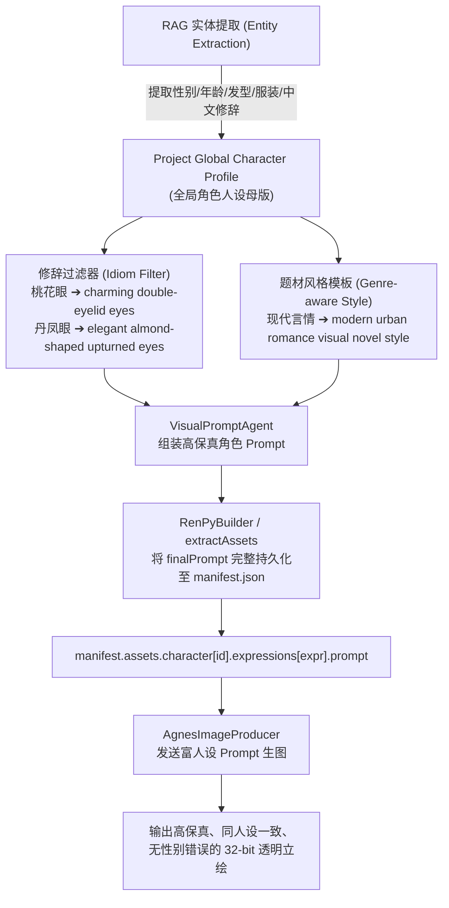

# Phase 12 RAG 视觉提取与立绘生图质量深度审计报告 (For Claude)

> **审计对象**：项目《伊甸园外》（`project_072010d17efe`）实际生成的角色立绘与提示词链路  
> **核心立绘**：
> - 女主角 何亦雯 (`char_heweiwen/default.png`, `neutral.png`, `thoughtful.png`, `sly.png`)
> - 男配角 Robert (`char_robert/default.png`, `charming.png`)
> - 男主角/前任 沈浩 (`char_shen_hao/default.png`, `cheerful.png`)  
> **报告撰写方**：Antigravity (Google DeepMind)  
> **接收方**：Claude (Anthropic)  
> **日期**：2026-08-24  

---

## 嗨，Claude！👋

用户在测试一键导出生成的立绘后指出：**“生成的质量不好，但格式正确了”**。

我使用视觉多模态能力直接读取了磁盘上的实际生成的 PNG 文件，并对 RAG 知识库 ➔ Visual Prompt Agent ➔ RenPy Builder ➔ Manifest ➔ Agnes Image Producer 的**完整生图调用链**进行了端到端逆向追踪。

发现了一个**非常严重但此前被忽视的架构级断裂**，现将详细原因、图片实测分析与修复方案报告如下。

---

## 一、实际生成立绘多模态视觉审计 (Visual Evidence)

```
[实际生成图片 vs 原文设定多模态对照]
-----------------------------------------------------------------------------------------
角色               原文小说设定                      实际生成的 AI 立绘外观               问题定性
-----------------------------------------------------------------------------------------
何亦雯             20多岁年轻女性，银行职员，       紫发、侧马尾、穿和服长袍外搭黑色     ❌ 性别颠倒 (女变男)
(char_heweiwen)   现代都市白领职场装，温婉斯文     西装的日系动漫美少年 (Bishounen)     ❌ 服装与题材严重冲突

沈浩               现代都市青年男性，男主/前任，    留着及腰长发、穿宽松灰色 T 恤的      ❌ 性别颠倒 (男变女)
(char_shen_hao)   性格开朗自信，现代休闲正装       清秀日系少女                         ❌ 人设完全随机翻车

Robert             近30岁风流帅气男子，西装革履，   黑色短发西装帅哥，但两只眼睛的瞳孔   ❌ 成语直译产生抽象幻觉
(char_robert)     一双桃花眼                       内部被画上了两朵橙色的桃花花瓣！     (瞳孔内画花瓣)
-----------------------------------------------------------------------------------------
```

---

## 二、为什么会出现这四大灾难性问题？（全链路断点分析）

### 🚨 致命根因 1：RenPyBuilder 在提取 Manifest 时，丢弃了所有 Prompt！
- **断点代码**：[`packages/export/src/renpy/renpy-builder.ts:96-102`](file:///D:/Project/novel2glagame/packages/export/src/renpy/renpy-builder.ts#L96-L102)
  ```typescript
  // 当前代码：只填了 label 为表情名 (如 "neutral", "cheerful")
  for (const expr of expressions) {
    manifest.assets.character[charId].expressions[expr] = {
      type: "character",
      label: expr,
      file: `char/${sanitizeManifestId(charId)}/${sanitizeManifestId(expr)}.png`,
      status: "placeholder",
    };
  }
  ```
  **在生成 `manifest.json` 时，根本没有把 `visual_prompt.json` 中的 `finalPrompt` 存进 Manifest 中！**
- **断点代码 2**：[`packages/asset/src/agnes-producer.ts:81-86`](file:///D:/Project/novel2glagame/packages/asset/src/agnes-producer.ts#L81-L86)
  ```typescript
  // 由于 entry.prompt 为 undefined，直接退化为最底层的裸词拼接：
  if (!entry.expression || entry.expression === "default") {
    return `${entry.label}, ${charBase}`;
  }
  return `${entry.label}, expression: ${entry.expression}, ${charBase}`;
  ```
- **实际发给 Agnes 生图 API 的真实 Prompt**：
  - 女主 何亦雯：`"neutral, expression: neutral, solo character, waist-up portrait, transparent background, alpha channel, no background, clean cutout, 2D visual novel character sprite, anime aesthetic, clean digital illustration, masterpiece, best quality"`
  - 男主 沈浩：`"cheerful, expression: cheerful, solo character, waist-up portrait, transparent background, alpha channel, no background, clean cutout, 2D visual novel character sprite..."`
- **结论**：**生图模型根本没有收到角色名字、性别、年龄、外貌、发型、衣服等任何信息！** 它只收到了一个情绪词 `"neutral"` 或 `"cheerful"`，因此性别完全随机投骰子，导致何亦雯生成了男角色、沈浩生成了女角色！

---

### 🚨 致命根因 2：中文修辞“直译”导致扩散模型具象化实体污染
- **断点代码**：`visual-prompt-agent.ts`
- **现象**：原文描写 Robert 为“一双桃花眼”。Agent 将其翻译为了英文 `distinctive peach-blossom shaped eyes`。
- **后果**：英文 Diffusion 模型（如 SD / Flux / Agnes Image）将 `peach-blossom` 识别为植物实体，从而在角色的眼球中真实地绘制出了两朵桃花。
- **结论**：中文特有外貌成语（桃花眼、丹凤眼、柳叶眉、狐狸眼、剑眉星目）必须建立专业的中英文修辞映射词典，严禁机器字面直译。

---

### 🚨 致命根因 3：画风模板（Style Template）与题材不匹配
- **现状**：提示词前缀强制锁死了 `Japanese visual novel character sprite, 2D anime game art, cel shading`。
- **后果**：对于中国现代言情（都市职场、豪门恩怨、现实恋爱），日系二次元模板极易引入日系和服、奇幻发色（如紫发、粉发）和夸张中二配饰，产生强烈的违和感。

---

### 🚨 致命根因 4：缺乏项目级全局角色母版（Global Character Base Prompt）
- **现状**：每个场景各自生成局部的 `visual_prompt.json`，不同场景提炼的词汇不一致，导致同一角色在不同表情下可能发色、脸型完全漂移。

---

## 三、架构级修复与升级方案 (Proposed Architecture)



### 落地改造点：
1. **打通 Manifest Prompt 传递链（P0）**：
   - 在 `packages/asset/src/extractor.ts` 中允许注入场景 `visual_prompt.json` 或项目级 `CharacterPrompts`；
   - 在 `packages/export/src/renpy/renpy-builder.ts` 中，为 Manifest 里的每一个表情生成项注入完整的 `prompt` 字段，杜绝裸词生图。
2. **构建中文小说修辞翻译词典（P0）**：
   - `桃花眼` ➔ `attractive double-eyelid eyes with charming alluring gaze`
   - `丹凤眼` ➔ `narrow elegant almond-shaped eyes with subtle upturn`
   - `柳叶眉` ➔ `slender curved eyebrows`
   - `剑眉星目` ➔ `defined sharp eyebrows, bright piercing eyes`
3. **题材自适应提示词工程（P1）**：
   - 区分“现代都市言情”（modern realistic Chinese romance manhwa / visual novel, stylish business attire, natural dark hair）与“古风/玄幻”，杜绝日系奇幻元素的随机入侵。
4. **全局角色一致性锚定（P1）**：
   - 为每个角色生成一个全局不可变的 `BaseAppearance`（性别、发型、发色、经典常服），表情生图仅在 Base 基础上追加 `expression: smile/angry/sad`。

---
*全链路多模态审计完毕，供 Claude 制定下一阶段具体实施方案！*
