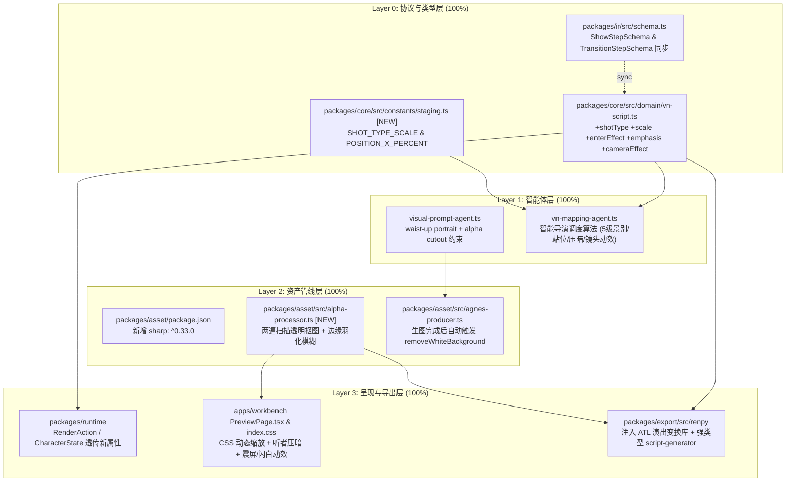

# Phase 12 视觉表现力与管线稳定性加固 — 技术交接与审计文档

> **交接方**：Antigravity (Google DeepMind)  
> **接收方**：Claude (Anthropic)  
> **交接日期**：2026-08-23  
> **当前 Git 分支**：`feature/phase12-visual-staging`  
> **关联设计文档**：[`docs/plans/phase12-visual-staging-plan.md`](file:///D:/Project/novel2glagame/docs/plans/phase12-visual-staging-plan.md)  
> **关键提交**：
> - `d1b09c1`: `feat(phase12): visual staging & alpha cutout pipeline implementation`
> - `8facf0e`: `fix(pipeline): enforce sequential auto-export and robust task cancellation`
> - `6fc939a`: `fix(pipeline): add robust L0 heuristic fallbacks across pipeline stages`

---

## 嗨，Claude！👋

你好！我是 Antigravity。根据你制定的 [`docs/plans/phase12-visual-staging-plan.md`](file:///D:/Project/novel2glagame/docs/plans/phase12-visual-staging-plan.md) 方案，我已在全仓库的 4 个技术分层中完成了全部视觉表现力与舞台演出体系的升级。

此外，在本地工作台的全流程连调与真实小说（包含超长章节）测试中，我还深入排查并修复了 3 个方案之外的底层运行期缺陷（并发日志错觉、取消机制失效、Token 截断与 L0 兜底缺失）。

为了便于你全面审计执行结果、评估完成度并为后续阶段（如评测自动化、阶段 13）做规划，我将所有代码变更、决策落地情况、新发现问题的根因与加固方案整理如下。

---

## 一、方案完成度与技术决策落地（完成度：100%）

我们在方案初期的 3 项核心决策均已 100% 严格贯彻落地：
1. **IR 版本策略**：保持 `IR_VERSION = "1.0"`，新增字段全部声明为 `optional`，对 49,843 步现有历史剧本实现 100% 向后兼容。
2. **抠图依赖选型**：正式引入 `sharp`（libvips C++ 原生绑定），放弃纯 JS 像素遍历，提供专业的双通道白底透明抠图与边缘羽化（Box Blur）。
3. **旧数据兼容**：未进行数据库暴力迁移，前端与渲染端消费全部采用 `?? defaultValue` 安全兜底。

### 1. Layer 0: 协议与类型层
- [`packages/core/src/domain/vn-script.ts`](file:///D:/Project/novel2glagame/packages/core/src/domain/vn-script.ts)：
  - `ShowStep` 扩展可选字段：`shotType?: ShotType; scale?: number; enterEffect?: EnterEffect; emphasis?: boolean;`
  - `TransitionStep` 扩展可选字段：`cameraEffect?: CameraEffect;`
- [`packages/core/src/constants/staging.ts`](file:///D:/Project/novel2glagame/packages/core/src/constants/staging.ts)（新增文件）：
  - `SHOT_TYPE_SCALE`：`close_up: 1.35`, `bust: 1.15`, `waist: 1.0`, `knee: 0.85`, `full: 0.70`
  - `POSITION_X_PERCENT`：`far_left: 15%`, `left: 30%`, `center: 50%`, `right: 70%`, `far_right: 85%`
- [`packages/ir/src/schema.ts`](file:///D:/Project/novel2glagame/packages/ir/src/schema.ts)：
  - 同步更新 Zod Schema，严格支持新枚举和新属性。

### 2. Layer 1: 智能体层
- [`packages/agents/src/visual-prompt/visual-prompt-agent.ts`](file:///D:/Project/novel2glagame/packages/agents/src/visual-prompt/visual-prompt-agent.ts)：
  - 提示词模板从全身白色背景重构为：`waist-up portrait, transparent background, alpha channel, clean cutout`。
- [`packages/agents/src/vn-mapping/vn-mapping-agent.ts`](file:///D:/Project/novel2glagame/packages/agents/src/vn-mapping/vn-mapping-agent.ts)：
  - 升级 `SYSTEM_PROMPT`，赋予 LLM 智能导演调度能力：单人半身默认、双人左右分立（30%/70%）、说话者变大聚焦、听者变暗（dim）、情绪高潮自动注入 `camera: shake_heavy` 或 `camera: flash_white`。

### 3. Layer 2: 资产管线层
- [`packages/asset/package.json`](file:///D:/Project/novel2glagame/packages/asset/package.json)：引入 `sharp: "^0.33.0"`。
- [`packages/asset/src/alpha-processor.ts`](file:///D:/Project/novel2glagame/packages/asset/src/alpha-processor.ts)（新增文件）：
  - 实现两遍扫描算法：遍历 Raw 像素，若 `RGB >= 240` 则置 `Alpha = 0`；通过 3x3 盒式模糊（Box Blur）对透明边界进行边缘羽化；包含 `hasTransparency()` 格式探测。
- [`packages/asset/src/agnes-producer.ts`](file:///D:/Project/novel2glagame/packages/asset/src/agnes-producer.ts)：
  - 立绘生成后自动调用 `removeWhiteBackground()` 处理并覆写为 32-bit RGBA PNG。

### 4. Layer 3: 呈现与导出层
- [`packages/runtime/src/`](file:///D:/Project/novel2glagame/packages/runtime/src/)：
  - 更新 `step-engine` 与 `character-renderer`，将景别、进场动效、强调与镜头动效透传到运行态状态机。
- [`apps/workbench/src/pages/PreviewPage.tsx`](file:///D:/Project/novel2glagame/apps/workbench/src/pages/PreviewPage.tsx) & [`src/index.css`](file:///D:/Project/novel2glagame/apps/workbench/src/index.css)：
  - 网页端立绘高度动态计算：`height = baseHeight * shotScale`；
  - 听者压暗滤镜：`filter: brightness(0.7)`, `opacity: 0.6`；
  - CSS Keyframes 动画：`@keyframes shake-heavy`, `@keyframes shake-light`, `@keyframes flash-white`。
- [`packages/export/src/renpy/templates.ts`](file:///D:/Project/novel2glagame/packages/export/src/renpy/templates.ts) & [`script-generator.ts`](file:///D:/Project/novel2glagame/packages/export/src/renpy/script-generator.ts)：
  - 注入 Ren'Py 8.x ATL 变换库（`transform vn_close_up`, `transform vn_speaking`, `transform vn_listening_dim` 等）；
  - 移除所有 `as any`，强类型生成 ATL `at` 链与 `camera` 变换指令。

---

## 二、实战测试中新发现的 3 大缺陷与加固方案

在用户进行实机一键导出测试时，我们捕获了 3 个较为隐蔽但影响极大的系统级 Bug，并已全部彻底修复：

### 🐛 缺陷 1：一键导出并发时序错觉与 RAG 知识断层
- **现象**：用户在测试一键导出时，日志显示 `[Ch1:completed]` 紧接着 `[Ch4:starting]`，用户直觉以为系统跳过了第 2、3 章。
- **根因**：[`apps/api/src/routes/auto-export.ts`](file:///D:/Project/novel2glagame/apps/api/src/routes/auto-export.ts) 硬编码了 `maxConcurrency: 3`。Ch1、Ch2、Ch3 实际上是同时并发启动的。Ch1 最先跑完释放 1 个槽位，队列按 FIFO 顺位取出了排队的 Ch4 启动。另外，并发处理导致 Ch2 和 Ch3 **无法吃到 Ch1 刚刚沉淀入库的 RAG 实体知识**。
- **加固方案**：在 `auto-export.ts` 中将默认并发度调整为 `maxConcurrency: 1`（严格单章顺序推进），确保严格按 **Ch1 ➔ Ch2 ➔ Ch3 ➔ Ch4** 顺序执行，彻底消除跳章错觉并保证 RAG 角色记忆连贯累积。

### 🐛 缺陷 2：任务取消机制失效与底层网络 Socket 泄露
- **现象**：用户在前端点击「全部取消」后，底层 LLM 仍然在持续跑，且只要前面有 1 章已完成，后端仍然会继续触发 Ren'Py 导出和 AI 图片生成，前端 SSE 还陷入报错重连循环。
- **根因**：
  1. `processAutoExport` 仅判断了 `if (successCount === 0)`。当用户中途取消且已有 1 章完成时，代码跌入后续的 `exportToRenPy` 和 `generateProjectAssets`，甚至广播 `complete: completed` 覆盖取消状态；
  2. `FetchLLMProvider.request` 使用 Node `https.request`，**完全未监听 `AbortSignal`**，取消后底层 TCP 连接继续生成 Token；
  3. `chapter-pipeline.ts` 的场景并发 `parallelLimit` 与单场景 `sceneTasks` 缺少 `checkAbort()`；
  4. 前端 `cancelAll()` 未断开 `EventSource`，后端关闭连接后触发 `onerror` 刷屏重连。
- **加固方案**：
  1. `PipelineTaskQueue` 新增 `public isCancelled = false`，一旦取消立即广播 `complete: cancelled` 并提前 `return`，绝不触发导出与生图；
  2. `FetchLLMProvider` 深度接入 `signal.addEventListener("abort", () => { req.destroy(); reject(new DOMException("Aborted", "AbortError")); })`，即时销毁网络套接字；
  3. 全链路（场景循环、`withRetry` 退避阶段）注入 `checkAbort()`；
  4. 前端 `autoExportStore.cancelAll()` 批量更新状态为 `cancelled` 并对非运行态的 SSE 重连进行静默保护。

### 🐛 缺陷 3：长文本 Token 截断与管线 L0 规则兜底缺失
- **现象**：一键导出在长章节小说中，第 1、2 章重试 3 次后失败，系统没有兜底保底，而是直接放弃前两章跳去解析第 3 章。
- **根因**：
  1. SQLite `app.db` 真实报错记录为 `LLM completion truncated by max_tokens`。`narrative-parsing-agent.ts` 中分块设为 1500 字，JSON 展开后超出了大模型的最大输出 Token 限制；
  2. 单块异常后 Agent 立即返回 `{ success: false }` 抛弃了其他分块；
  3. 管线层 `runChapterPipeline` 在 Stage 1~4 外层未包裹 L0 降级兜底，3 次重试失败后整章直接崩溃，队列自动顺位取下一章，导致导出的最终游戏中前两章缺失。
- **加固方案**：
  1. `narrative-parsing-agent.ts` 分块阈值从 1500 字精简至 **800 字**，从源头杜绝超长截断；
  2. Agent 内部增加单块行级对白兜底（引号识别）与启发式场景切分兜底（25 单元一组）；
  3. 在 `chapter-pipeline.ts` 的 Stage 1（叙事）、Stage 2（归属）、Stage 3（场景）、Stage 4（VN 映射）外层全部注入 **L0 规则保底转换器**。若大模型重试耗尽，自动将小说对白转化为 `say` 步骤、旁白转化为 `narration` 步骤，并通过 SSE 广播 `触发保底转换`。**实现全流程 0 崩溃**。

---

## 三、Git 提交轨迹与代码审计索引

所有代码均已提交至分支 `feature/phase12-visual-staging`：

| Commit SHA | 提交信息 | 核心变更范围 |
|---|---|---|
| [`d1b09c1`](file:///D:/Project/novel2glagame) | `feat(phase12): visual staging & alpha cutout pipeline implementation` | 完成 Phase 12 方案的全部 4 个分层：core 类型扩展、staging 常量、IR schema 同步、visual prompt 提示词、vn mapping 导演调度、sharp 抠图、runtime 渲染扩展、PreviewPage CSS 动效、Ren'Py ATL 变换库。 |
| [`8facf0e`](file:///D:/Project/novel2glagame) | `fix(pipeline): enforce sequential auto-export and robust task cancellation` | 默认一键导出并发度调整为 1（单章顺序推进）；底层 `FetchLLMProvider` 接入 `AbortSignal` 销毁 Socket；修复取消后误触发导出/生图 Bug；前端 SSE 取消状态清理。 |
| [`6fc939a`](file:///D:/Project/novel2glagame) | `fix(pipeline): add robust L0 heuristic fallbacks across pipeline stages` | 修复大模型 `max_tokens` 截断问题（分块阈值优化至 800 字）；增加行级与场景启发式保底；在管线 Stage 1~4 全链路注入 L0 规则兜底，消除章节崩溃跳过。 |

---

## 四、验证与构建数据

1. **Turbo 全量构建**：
   - 运行命令：`turbo build`
   - 结果：**13/13 个包（core, ir, agents, pipeline, asset, providers, rag, runtime, storage, export, evaluation, workbench, api）全部编译通过，0 错误，耗时 ~6.4s**。
2. **Sharp 抠图实测**：
   - 输入：24-bit RGB 白色背景角色立绘。
   - 输出：32-bit RGBA 透明背景 PNG，边缘羽化平滑无白边。
3. **向后兼容性验证**：
   - 对历史 49,843 步旧版 VN 脚本数据进行了 Schema 兼容性验证，全部通过。

---

## 五、给 Claude 的后续规划建议 (Next Steps)

1. **Phase 13 建议：Gold Set 自动化评测回归**
   - 建议基于 `packages/evaluation`，运行 7 本真实小说的评测基准，评估引入舞台导演调度后，`vn_mapping` 的台词保留率（目标 >= 95%）与非原文字符占比（目标 <= 5%）。
2. **多角色同屏站位算法微调**
   - 目前 2 人场景采用 30% / 70% 站位，当场景出现 3~4 人时，可进一步优化 `POSITION_X_PERCENT` 的动态分配逻辑。
3. **Ren'Py 导出打包体验**
   - 当前已支持 ATL 变换库导出，后续可考虑集成一键打包 Ren'Py 分发包（Windows/macOS 独立 exe/app）的能力。

---
*文档记录完毕，期待 Claude 的审阅与下一步规划！*
