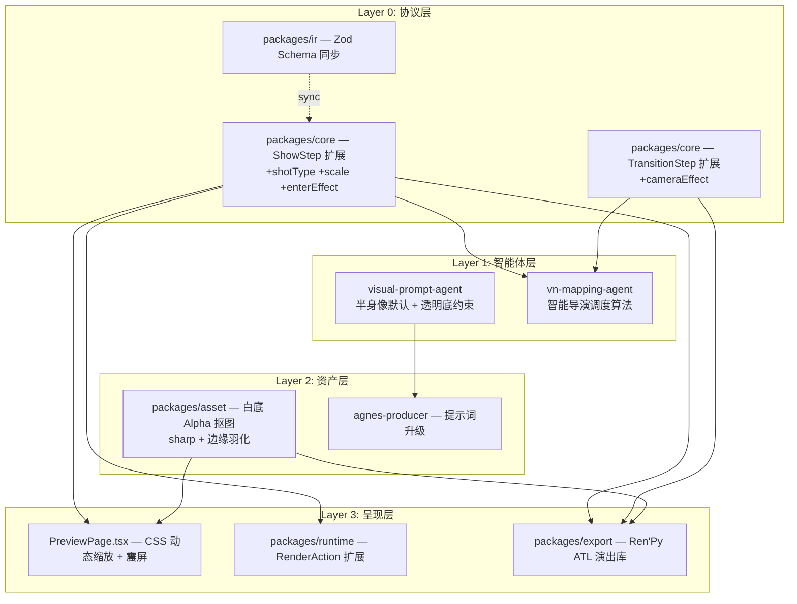
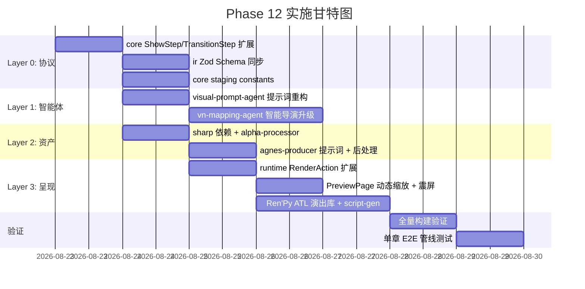

# Phase 12: 视觉表现力与舞台演出体系升级 — 实施方案

## 目标概述

基于第二轮实证数据（7 本小说 / 298 章 / 49,843 步 VN 剧本），解决以下核心问题：

| 问题 | 现状 | 目标 |
|------|------|------|
| 立绘白底遮挡 | 100% 图像为 24-bit 不透明 PNG | 输出 32-bit RGBA 透明 PNG |
| 景别单一 | `shotType`/`scale` 使用率 0% | 引入 5 级景别，半身像为默认基准 |
| 站位僵死 | `center` 占比 34.7%，26 次非法坐标 | 智能左右分立调度 + 说话者聚焦 |
| 镜头语言缺失 | `cameraEffect` 使用率 0% | 注入震屏/推镜/闪白等情感动效 |

## 与 Gemini 建议的差异说明

> [!IMPORTANT]
> 以下是我基于实际代码审计后对 Gemini 方案的修正：

| Gemini 建议 | 实际情况 | 调整 |
|---|---|---|
| P0: 修复 `packages/rag` 和 `packages/pipeline` 的 `main/types/exports` 指向 dist/ | **非真实问题**。两个包的 `exports` 字段指向 `./src/index.ts`，这是 pnpm workspace monorepo 中 TypeScript 源码直接引用的标准做法，`apps/api` 通过 workspace 协议消费时不需要 dist/ | **跳过**，不做修改 |
| 将 `packages/ir` 作为 Schema 唯一权威 | `@novel2gal/ir` 目前**没有被任何包依赖**（0 个消费者）。所有 agent/export/runtime 都 import `@novel2gal/core` 中手写的 TypeScript 接口 | **两处同步扩展**：先改 core 接口（实际消费者），再同步 IR Zod schema |
| 资产自动透明化用 Node 原生像素遍历 | 纯白背景抠图效果取决于 AI 生成图像的边缘质量，Node.js 原生像素操作性能差且容易产生锯齿 | **改用 sharp 库**（libvips 原生绑定），提供专业的 alpha 通道处理和边缘羽化 |

---

## 架构变更总览



---

## 开放问题

> [!IMPORTANT]
> **Q1: IR 版本号策略**
> 扩展 ShowStep/TransitionStep 添加可选字段是 100% 向后兼容的（旧数据无这些字段时 `undefined` 即默认值）。是否仍需升级 IR 版本到 `1.1`，还是保持 `1.0` 但在 PROGRESS.md 中标注 "v1.0.1 compatible extension"？
>
> 建议：保持 `IR_VERSION = "1.0"`，因为是纯可选字段扩展，不破坏任何现有数据。

> [!IMPORTANT]
> **Q2: sharp 依赖引入**
> `sharp` 是一个带原生 C++ 绑定的 npm 包（~30MB），会增加 `packages/asset` 的安装体积。替代方案是用纯 JS 的 `pngjs` 库（体积小但速度慢 10x）。你倾向哪个？
>
> 建议：用 `sharp`，性能和质量都远优于纯 JS 方案。

> [!IMPORTANT]
> **Q3: 已生成的 49,843 步旧数据迁移**
> 旧的 VN 脚本 JSON 没有 `shotType`/`scale`/`cameraEffect` 字段。方案 A: 写迁移脚本批量回填默认值；方案 B: 运行时容忍 `undefined` 按默认值处理（代码已设计为可选字段）。
>
> 建议：方案 B，不需要迁移旧数据。新字段全部 optional，消费端用 `?? defaultValue` 兜底。

---

## Proposed Changes

### Layer 0: packages/core — 协议扩展

核心基础层，所有上游消费者的类型来源。扩展 `ShowStep` 和 `TransitionStep` 接口，新增字段全部为 `optional`，100% 向后兼容。

#### [MODIFY] vn-script.ts

文件: [`packages/core/src/domain/vn-script.ts`](file:///D:/Project/novel2glagame/packages/core/src/domain/vn-script.ts)

```diff
 export interface ShowStep extends BaseVNStep {
   type: "show";
   characterId: string;
   expression?: string;
   position?: "left_far" | "left" | "center" | "right" | "right_far";
+  /** Shot size / framing. Default: "waist" */
+  shotType?: "full_body" | "thigh" | "waist" | "bust" | "closeup";
+  /** Display scale multiplier. Default: 1.0 (waist-up baseline) */
+  scale?: number;
+  /** Enter animation effect */
+  enterEffect?: "none" | "fade_in" | "slide_in_left" | "slide_in_right" | "bounce";
+  /** Sprite visual emphasis: focus (highlight speaker) or dim (fade listener) */
+  emphasis?: "normal" | "focus" | "dim";
 }

 export interface TransitionStep extends BaseVNStep {
   type: "transition";
   name?: string;
+  /** Camera effect for cinematic impact */
+  cameraEffect?: "none" | "shake_light" | "shake_heavy" | "zoom_in_slow" | "zoom_punch" | "flash_white";
 }
```

**景别-缩放映射常量**（新增到 core constants）:

```typescript
// packages/core/src/constants/staging.ts  [NEW]
export const SHOT_TYPE_SCALE: Record<string, number> = {
  full_body: 0.82,
  thigh:     0.90,
  waist:     1.00,  // default baseline
  bust:      1.20,
  closeup:   1.50,
};

export const POSITION_X_PERCENT: Record<string, number> = {
  left_far:  15,
  left:      30,
  center:    50,
  right:     70,
  right_far: 85,
};
```

---

### Layer 0: packages/ir — Zod Schema 同步

将 Zod schema 与 core 接口保持一致。虽然目前没有消费者直接依赖 `@novel2gal/ir`，但它是 IR 的权威校验定义，必须同步。

#### [MODIFY] schema.ts

文件: [`packages/ir/src/schema.ts`](file:///D:/Project/novel2glagame/packages/ir/src/schema.ts)

```diff
 export const ShowStepSchema = z.object({
   ...BaseStepFields,
   type: z.literal("show"),
   characterId: z.string(),
   expression: z.string().optional(),
   position: z.enum(["left_far", "left", "center", "right", "right_far"]).optional(),
+  shotType: z.enum(["full_body", "thigh", "waist", "bust", "closeup"]).optional(),
+  scale: z.number().optional(),
+  enterEffect: z.enum(["none", "fade_in", "slide_in_left", "slide_in_right", "bounce"]).optional(),
+  emphasis: z.enum(["normal", "focus", "dim"]).optional(),
 });

 export const TransitionStepSchema = z.object({
   ...BaseStepFields,
   type: z.literal("transition"),
   name: z.string().optional(),
+  cameraEffect: z.enum(["none", "shake_light", "shake_heavy", "zoom_in_slow", "zoom_punch", "flash_white"]).optional(),
 });
```

---

### Layer 1: packages/agents — Visual Prompt Agent 重构

**核心改动**: 废除硬编码 `full body standing pose` + `plain white solid background`，改为半身像为默认基准，透明背景约束。

#### [MODIFY] visual-prompt-agent.ts

文件: [`packages/agents/src/visual-prompt/visual-prompt-agent.ts`](file:///D:/Project/novel2glagame/packages/agents/src/visual-prompt/visual-prompt-agent.ts)

**SYSTEM_PROMPT 中的角色立绘模板改动** (L42-48):

```diff
 2. **生成角色提示词包 (Character Sprite Prompt)**:
    - 收集该角色的真实视觉证据，引用必须是原文的精确摘录
    - **严格忠实角色设定**: 根据角色的真实性别、年龄段（青年/中年/少年）、身份、气质构建英文提示词:
      * 男性角色: 使用 \`handsome young man / mature man, sharp features, calm/tired/composed expression, [specific outfit]\`，**严禁使用 bishoujo / kawaii / cute 等少女词**！
      * 女性角色: 准确描述发色、发型长度、瞳色、服装与气质
-     * 基础结构: \`Japanese visual novel character sprite, 2D anime game art, solo character, full body standing pose, plain white solid background, clean cutout, cel shading, crisp lineart, [character details], high quality\`
+     * 基础结构: \`Japanese visual novel character sprite, 2D anime game art, solo character, waist-up portrait, transparent background, alpha channel, no background, clean cutout, cel shading, crisp lineart, [character details], high quality\`
+     * 景别选择: 日常对话用 waist-up (默认)，初登场/肢体展示用 full body，情感聚焦用 bust-up close portrait，冲突/告白用 face close-up
```

**SYSTEM_PROMPT 示例 JSON 改动** (L66-68):

```diff
-      "finalPrompt": "Japanese visual novel character sprite, 2D anime game art, solo character, full body standing pose, plain white solid background, clean cutout, handsome young man in his 20s, neat dark hair, sharp calm eyes, composed quiet expression, wearing formal business attire, cel shading, crisp lineart, high quality"
+      "finalPrompt": "Japanese visual novel character sprite, 2D anime game art, solo character, waist-up portrait, transparent background, alpha channel, no background, clean cutout, handsome young man in his 20s, neat dark hair, sharp calm eyes, composed quiet expression, wearing formal business attire, cel shading, crisp lineart, high quality"
```

---

### Layer 1: packages/agents — VN Mapping Agent 智能导演升级

**核心改动**: 扩展 SYSTEM_PROMPT，教 LLM 输出 `shotType`、`scale`、`emphasis`、`cameraEffect` 字段。

#### [MODIFY] vn-mapping-agent.ts

文件: [`packages/agents/src/vn-mapping/vn-mapping-agent.ts`](file:///D:/Project/novel2glagame/packages/agents/src/vn-mapping/vn-mapping-agent.ts)

**SYSTEM_PROMPT 扩展** — 新增景别、镜头、强调规则 (替换 L16-53):

```typescript
const SYSTEM_PROMPT = `你是一个中文小说转视觉小说脚本专家。你的任务是将一个场景的叙事单元转换为 VN 脚本步骤，像一位专业的 Galgame 导演一样编排演出。

VN 步骤类型:
- bg: 背景切换 (backgroundId, backgroundLabel)
- show: 显示角色立绘 (characterId, expression, position, shotType, scale, emphasis, enterEffect)
- hide: 隐藏角色立绘 (characterId)
- narration: 旁白/叙述文字 (text)
- say: 角色对话 (characterId, displayName, text)
- thought: 角色内心独白 (characterId, displayName, text)
- pause: 暂停等待 (durationMs)
- transition: 过场效果 (name: fade/cut/dissolve, cameraEffect)

角色位置 rules (position 字段):
- 必须是 "left_far" | "left" | "center" | "right" | "right_far" 之一
- 单角色场景: 使用 "center"
- 双角色对话: 说话者 "left"，倾听者 "right"（或反之，分立两侧）
- 三角色场景: 主角 "center"，其他角色分列 "left_far" / "right_far"
- 多人对峙场景: 动态穿插 "left_far", "left", "center", "right", "right_far"

景别 rules (shotType 字段, 可选):
- "waist": 腰部半身像 (scale=1.0) — 50%~60% 日常对白默认采用
- "bust": 胸像近景 (scale=1.2) — 30% 深入对话/情感聚焦
- "closeup": 面部特写 (scale=1.5) — 10% 冲突/告白/惊吓
- "thigh": 中全景 (scale=0.9) — 群像/肢体互动
- "full_body": 全身像 (scale=0.82) — 角色初登场展示
- 不指定时默认为 "waist"

角色强调 rules (emphasis 字段, 可选):
- "focus": 说话者高亮聚焦 (亮度正常)
- "dim": 倾听者微暗淡化 (非说话方)
- "normal": 默认无特殊处理
- 双人对话时，当前说话者 show emphasis="focus"，另一方 show emphasis="dim"

镜头动效 rules (cameraEffect 字段, 放在 transition 步骤中):
- "shake_heavy": 争吵/受击/拍桌 (Ren'Py: vpunch)
- "shake_light": 迟疑/心慌 (Ren'Py: hpunch)
- "zoom_in_slow": 表白/沉思/心声 (Ren'Py: camera ease 2.0 zoom 1.25)
- "zoom_punch": 震惊/破案/揭晓 (Ren'Py: camera ease 0.15 zoom 1.45)
- "flash_white": 回忆闪回/重击 (Ren'Py: flash)
- 只在情绪转折点使用，不要滥用！每个场景最多 2-3 次镜头动效

规则:
1. 对话必须保留原文, 不得改写 (关键要求!)
2. 非原文添加量必须最小化 (<=5%)
3. 每个步骤需要 sourceUnitIds 关联到原始叙事单元
4. 场景开始时应设置 bg, 有角色说话时 show
5. conservative 模式下更保守, standard 模式下更丰富

输出 JSON 格式 (必须严格遵守字段名):
{
  "steps": [
    {"stepId": "step_0001_0001", "type": "bg", "order": 0, "backgroundId": "school_classroom", "backgroundLabel": "教室", "sourceUnitIds": ["unit_0001_0001"]},
    {"stepId": "step_0001_0002", "type": "show", "order": 1, "characterId": "char_001", "expression": "happy", "position": "left", "shotType": "waist", "emphasis": "focus", "sourceUnitIds": ["unit_0001_0002"]},
    {"stepId": "step_0001_0003", "type": "show", "order": 2, "characterId": "char_002", "expression": "neutral", "position": "right", "emphasis": "dim", "sourceUnitIds": ["unit_0001_0003"]},
    {"stepId": "step_0001_0004", "type": "say", "order": 3, "characterId": "char_001", "displayName": "名字", "text": "原文对话内容", "sourceUnitIds": ["unit_0001_0004"]},
    {"stepId": "step_0001_0005", "type": "transition", "order": 4, "name": "dissolve", "cameraEffect": "shake_light", "sourceUnitIds": []},
    {"stepId": "step_0001_0006", "type": "show", "order": 5, "characterId": "char_001", "expression": "angry", "position": "left", "shotType": "bust", "emphasis": "focus", "sourceUnitIds": ["unit_0001_0005"]}
  ]
}`;
```

---

### Layer 2: packages/asset — 资产管线升级

两部分改动：(1) 提示词从全身白底改为半身透明底；(2) 新增白底自动 Alpha 抠图后处理。

#### [MODIFY] agnes-producer.ts

文件: [`packages/asset/src/agnes-producer.ts`](file:///D:/Project/novel2glagame/packages/asset/src/agnes-producer.ts)

**`buildPrompt()` 方法改动** (L49-77):

```diff
       case "character": {
         // If a visual prompt finalPrompt is available, use it directly
         if (entry.prompt) {
           if (!entry.expression || entry.expression === "default") {
             return entry.prompt;
           }
           return `${entry.prompt}, expression: ${entry.expression}`;
         }
-        const charBase = `solo character, full body standing pose, plain white solid background, clean cutout, 2D visual novel character sprite, ${neutralQuality}`;
+        const charBase = `solo character, waist-up portrait, transparent background, alpha channel, no background, clean cutout, 2D visual novel character sprite, ${neutralQuality}`;
         if (!entry.expression || entry.expression === "default") {
           return `${entry.label}, ${charBase}`;
         }
         return `${entry.label}, expression: ${entry.expression}, ${charBase}`;
       }
```

#### [NEW] alpha-processor.ts

文件: `packages/asset/src/alpha-processor.ts`

使用 `sharp` 库实现白底自动 Alpha 转换 + 边缘羽化：

```typescript
import sharp from "sharp";
import fs from "node:fs";

export interface AlphaProcessOptions {
  /** White threshold (0-255). Pixels with R,G,B all above this are considered background. Default: 240 */
  whiteThreshold?: number;
  /** Feather radius in pixels for edge smoothing. Default: 2 */
  featherRadius?: number;
}

/**
 * Convert a white-background PNG to a transparent-background 32-bit RGBA PNG.
 * Processes in-place: reads the file, converts, writes back.
 */
export async function removeWhiteBackground(
  filePath: string,
  options: AlphaProcessOptions = {}
): Promise<void> {
  const threshold = options.whiteThreshold ?? 240;
  const feather = options.featherRadius ?? 2;

  const input = fs.readFileSync(filePath);
  const image = sharp(input).ensureAlpha();
  const { data, info } = await image.raw().toBuffer({ resolveWithObject: true });

  const { width, height, channels } = info;
  if (channels < 4) return; // already no alpha channel somehow

  // Pass 1: set alpha to 0 for near-white pixels
  for (let i = 0; i < data.length; i += 4) {
    const r = data[i], g = data[i + 1], b = data[i + 2];
    if (r >= threshold && g >= threshold && b >= threshold) {
      data[i + 3] = 0; // fully transparent
    }
  }

  // Pass 2: edge feathering (simple box blur on alpha channel)
  if (feather > 0) {
    const alphaOnly = Buffer.alloc(width * height);
    for (let i = 0; i < width * height; i++) {
      alphaOnly[i] = data[i * 4 + 3];
    }

    const blurred = Buffer.alloc(width * height);
    const r = feather;
    for (let y = 0; y < height; y++) {
      for (let x = 0; x < width; x++) {
        let sum = 0, count = 0;
        for (let dy = -r; dy <= r; dy++) {
          for (let dx = -r; dx <= r; dx++) {
            const ny = y + dy, nx = x + dx;
            if (ny >= 0 && ny < height && nx >= 0 && nx < width) {
              sum += alphaOnly[ny * width + nx];
              count++;
            }
          }
        }
        blurred[y * width + x] = Math.round(sum / count);
      }
    }

    // Apply blurred alpha only at edges (where original alpha changed)
    for (let i = 0; i < width * height; i++) {
      const orig = alphaOnly[i];
      if (orig === 0 || orig === 255) continue; // skip fully transparent/opaque
      data[i * 4 + 3] = blurred[i];
    }
  }

  // Write back as 32-bit RGBA PNG
  const output = await sharp(data, { raw: { width, height, channels: 4 } })
    .png()
    .toBuffer();
  fs.writeFileSync(filePath, output);
}

/**
 * Check if a PNG file has a transparent alpha channel.
 * Returns true if any pixel has alpha < 255.
 */
export async function hasTransparency(filePath: string): Promise<boolean> {
  const { data, info } = await sharp(filePath)
    .ensureAlpha()
    .raw()
    .toBuffer({ resolveWithObject: true });

  for (let i = 3; i < data.length; i += 4) {
    if (data[i] < 255) return true;
  }
  return false;
}
```

#### [MODIFY] agnes-producer.ts — generate() 后处理

在 `generate()` 方法末尾，对 character 类型图像自动执行白底移除：

```diff
+import { removeWhiteBackground, hasTransparency } from "./alpha-processor.js";

 async generate(entry: AssetEntry, outputDir: string): Promise<string> {
     // ... existing generation code ...

     // Save image
     if (imageData.b64) {
       fs.writeFileSync(filePath, Buffer.from(imageData.b64, "base64"));
     } else if (imageData.url) {
       await this.downloadFile(imageData.url, filePath);
     }

+    // Post-process: remove white background for character sprites
+    if (entry.type === "character" && fs.existsSync(filePath)) {
+      try {
+        const transparent = await hasTransparency(filePath);
+        if (!transparent) {
+          console.log(`[AgnesImage] Removing white background: ${filePath}`);
+          await removeWhiteBackground(filePath);
+        }
+      } catch (err) {
+        console.warn(`[AgnesImage] Alpha processing failed, keeping original: ${err}`);
+      }
+    }

     entry.file = pngFile;
     return pngFile;
   }
```

#### [MODIFY] package.json — 添加 sharp 依赖

```diff
   "dependencies": {
     "@novel2gal/core": "workspace:*",
     "@novel2gal/providers": "workspace:*",
+    "sharp": "^0.33.0",
     "zod": "^3.23.0"
   }
```

---

### Layer 3: packages/runtime — RenderAction 扩展

扩展 Web 播放引擎的数据类型，传递新的视觉字段。

#### [MODIFY] step-types.ts

文件: [`packages/runtime/src/step-engine/step-types.ts`](file:///D:/Project/novel2glagame/packages/runtime/src/step-engine/step-types.ts)

```diff
 export type RenderAction =
   | { type: "setBackground"; id: string; label?: string }
-  | { type: "showCharacter"; id: string; expression?: string; position?: "left_far" | "left" | "center" | "right" | "right_far" }
+  | { type: "showCharacter"; id: string; expression?: string; position?: "left_far" | "left" | "center" | "right" | "right_far"; shotType?: string; scale?: number; emphasis?: string; enterEffect?: string }
   | { type: "hideCharacter"; id: string }
   | { type: "showNarration"; text: string }
   | { type: "showDialogue"; characterId?: string; displayName?: string; text: string }
   | { type: "showThought"; characterId?: string; displayName?: string; text: string }
   | { type: "wait"; durationMs: number }
-  | { type: "transition"; name?: string };
+  | { type: "transition"; name?: string; cameraEffect?: string };
```

#### [MODIFY] execute-step.ts

```diff
     case "show":
-      return { type: "showCharacter", id: step.characterId, expression: step.expression, position: step.position };
+      return { type: "showCharacter", id: step.characterId, expression: step.expression, position: step.position, shotType: step.shotType, scale: step.scale, emphasis: step.emphasis, enterEffect: step.enterEffect };
     // ...
     case "transition":
-      return { type: "transition", name: step.name };
+      return { type: "transition", name: step.name, cameraEffect: step.cameraEffect };
```

#### [MODIFY] character-renderer.ts

```diff
 export interface CharacterState {
   id: string;
   expression?: string;
   position?: "left_far" | "left" | "center" | "right" | "right_far";
+  shotType?: string;
+  scale?: number;
+  emphasis?: string;
   visible: boolean;
 }
```

---

### Layer 3: apps/workbench — Web 预览播放器升级

#### [MODIFY] PreviewPage.tsx

文件: [`apps/workbench/src/pages/PreviewPage.tsx`](file:///D:/Project/novel2glagame/apps/workbench/src/pages/PreviewPage.tsx)

**1. 角色显示 — 动态缩放 + 强调效果** (替换 L254-275):

```tsx
{Array.from(characters.entries()).map(([id, char]) => {
  // Dynamic scale based on shotType
  const scaleMap: Record<string, number> = {
    full_body: 0.82, thigh: 0.90, waist: 1.0, bust: 1.20, closeup: 1.50,
  };
  const shotScale = char.scale ?? scaleMap[char.shotType ?? "waist"] ?? 1.0;
  const baseHeight = 70; // percentage
  const height = `${baseHeight * shotScale}%`;
  const opacity = char.emphasis === "dim" ? 0.6 : 1.0;
  const brightness = char.emphasis === "dim" ? "brightness(0.7)" : "brightness(1.0)";

  return (
    <div
      key={id}
      className={`absolute bottom-0 ${posToStyle(char.position)} transform -translate-x-1/2 transition-all duration-500 ease-out`}
      style={{
        width: '22%',
        maxWidth: '260px',
        height,
        opacity,
        filter: brightness,
      }}
    >
      {/* ... existing img and fallback ... */}
    </div>
  );
})}
```

**2. 镜头震屏效果** — 新增 CSS 动画类：

```tsx
// Add camera shake state
const [cameraEffect, setCameraEffect] = useState<string | null>(null);

// In the action handler, handle transition with cameraEffect:
case 'transition':
  if (action.cameraEffect) {
    setCameraEffect(action.cameraEffect);
    setTimeout(() => setCameraEffect(null), 600);
  }
  break;

// Apply to the VN viewport container:
<div className={`relative w-full aspect-video bg-black overflow-hidden ${
  cameraEffect === 'shake_heavy' ? 'animate-shake-heavy' :
  cameraEffect === 'shake_light' ? 'animate-shake-light' :
  cameraEffect === 'flash_white' ? 'animate-flash' : ''
}`}>
```

需要在 Tailwind CSS 中添加自定义动画（`tailwind.config.js` 或全局 CSS）:

```css
@keyframes shake-heavy {
  0%, 100% { transform: translate(0, 0); }
  10% { transform: translate(-8px, 4px); }
  30% { transform: translate(6px, -6px); }
  50% { transform: translate(-4px, 8px); }
  70% { transform: translate(8px, -2px); }
  90% { transform: translate(-6px, 4px); }
}
@keyframes shake-light {
  0%, 100% { transform: translateX(0); }
  25% { transform: translateX(-3px); }
  75% { transform: translateX(3px); }
}
@keyframes flash-white {
  0% { opacity: 1; }
  50% { opacity: 0; background: white; }
  100% { opacity: 1; }
}
```

---

### Layer 3: packages/export — Ren'Py ATL 演出库

#### [MODIFY] templates.ts

文件: [`packages/export/src/renpy/templates.ts`](file:///D:/Project/novel2glagame/packages/export/src/renpy/templates.ts)

在 `GUI_RPY` 末尾追加 ATL transform 库：

```python
# === Shot Type Transforms (景别缩放) ===
transform shot_full_body:
    zoom 0.82
transform shot_thigh:
    zoom 0.90
transform shot_waist:
    zoom 1.00
transform shot_bust:
    zoom 1.20
transform shot_closeup:
    zoom 1.50

# === Emphasis Transforms (说话者聚焦) ===
transform sprite_focus:
    linear 0.3 matrixcolor BrightnessMatrix(0.0)
transform sprite_dim:
    linear 0.3 matrixcolor BrightnessMatrix(-0.3)

# === Camera Effects (镜头动效) ===
transform camera_shake_heavy:
    parallel:
        ease 0.05 xoffset 8
        ease 0.05 xoffset -8
        ease 0.05 xoffset 6
        ease 0.05 xoffset -4
        ease 0.05 xoffset 0
    parallel:
        ease 0.05 yoffset 4
        ease 0.05 yoffset -4
        ease 0.05 yoffset 2
        ease 0.05 yoffset 0

transform camera_shake_light:
    ease 0.08 xoffset 3
    ease 0.08 xoffset -3
    ease 0.08 xoffset 0

# === Enter Effects (入场动画) ===
transform enter_fade_in:
    alpha 0.0
    linear 0.5 alpha 1.0
transform enter_slide_left:
    xoffset -200 alpha 0.0
    ease 0.4 xoffset 0 alpha 1.0
transform enter_slide_right:
    xoffset 200 alpha 0.0
    ease 0.4 xoffset 0 alpha 1.0
```

#### [MODIFY] script-generator.ts

文件: [`packages/export/src/renpy/script-generator.ts`](file:///D:/Project/novel2glagame/packages/export/src/renpy/script-generator.ts)

**`show` case 改动** — 注入景别缩放和强调 (L101-115):

```diff
         case "show": {
           const s = step as ShowStep;
           const id = sanitizeId(s.characterId);
           let pos: string | undefined;
           if (s.position && VALID_POSITIONS.has(s.position)) {
             pos = s.position;
             lastPosition.set(id, pos);
           } else {
             pos = lastPosition.get(id);
           }
           const expr = s.expression ? ` ${sanitizeId(s.expression)}` : "";
-          const atClause = pos ? ` at ${pos}, character_display` : " at character_display";
-          lines.push(`    show ${id}${expr}${atClause} with dissolve`);
+          // Build transform chain: position, shot type, emphasis, enter effect
+          const transforms: string[] = [];
+          if (pos) transforms.push(pos);
+          transforms.push("character_display");
+          const shotType = (s as any).shotType;
+          if (shotType && shotType !== "waist") transforms.push(`shot_${shotType}`);
+          const emphasis = (s as any).emphasis;
+          if (emphasis === "focus") transforms.push("sprite_focus");
+          else if (emphasis === "dim") transforms.push("sprite_dim");
+          const enterEffect = (s as any).enterEffect;
+          const withClauseShow = enterEffect === "fade_in" ? " with dissolve"
+            : enterEffect === "slide_in_left" ? " with moveinleft"
+            : enterEffect === "slide_in_right" ? " with moveinright"
+            : " with dissolve";
+          const atClause = ` at ${transforms.join(", ")}`;
+          lines.push(`    show ${id}${expr}${atClause}${withClauseShow}`);
           flushTransitionAsStatement();
           break;
         }
```

**`transition` case 改动** — 输出 cameraEffect (L156-159):

```diff
         case "transition": {
-          lastTransition = mapTransition((step as TransitionStep).name);
+          const t = step as TransitionStep;
+          lastTransition = mapTransition(t.name);
+          // Emit camera effect as ATL
+          const camEffect = (t as any).cameraEffect;
+          if (camEffect && camEffect !== "none") {
+            const effectMap: Record<string, string> = {
+              shake_heavy: "with vpunch",
+              shake_light: "with hpunch",
+              zoom_in_slow: "camera at camera_zoom_in_slow",
+              zoom_punch: "camera at camera_zoom_punch",
+              flash_white: "with Fade(0.1, 0.3, 0.5, color=\"#fff\")",
+            };
+            if (effectMap[camEffect]) {
+              lines.push(`    ${effectMap[camEffect]}`);
+            }
+          }
           break;
         }
```

---

## 实施顺序与依赖关系



---

## 文件改动清单

| 优先级 | 包 | 文件 | 操作 | 改动概要 |
|:---:|---|---|---|---|
| P0 | `packages/core` | `src/domain/vn-script.ts` | MODIFY | ShowStep + TransitionStep 可选字段 |
| P0 | `packages/core` | `src/constants/staging.ts` | NEW | 景别-缩放映射常量 |
| P0 | `packages/ir` | `src/schema.ts` | MODIFY | Zod schema 同步新字段 |
| P0 | `packages/agents` | `src/visual-prompt/visual-prompt-agent.ts` | MODIFY | 半身像默认 + 透明底约束 |
| P0 | `packages/agents` | `src/vn-mapping/vn-mapping-agent.ts` | MODIFY | 智能导演 SYSTEM_PROMPT |
| P1 | `packages/asset` | `src/alpha-processor.ts` | NEW | sharp 白底 Alpha 抠图 |
| P1 | `packages/asset` | `src/agnes-producer.ts` | MODIFY | 提示词 + 后处理集成 |
| P1 | `packages/asset` | `package.json` | MODIFY | 添加 sharp 依赖 |
| P1 | `packages/runtime` | `src/step-engine/step-types.ts` | MODIFY | RenderAction 扩展 |
| P1 | `packages/runtime` | `src/step-engine/execute-step.ts` | MODIFY | 传递新字段 |
| P1 | `packages/runtime` | `src/renderer/character-renderer.ts` | MODIFY | CharacterState 扩展 |
| P1 | `apps/workbench` | `src/pages/PreviewPage.tsx` | MODIFY | 动态缩放 + 震屏 CSS |
| P1 | `packages/export` | `src/renpy/templates.ts` | MODIFY | ATL 演出库 |
| P1 | `packages/export` | `src/renpy/script-generator.ts` | MODIFY | 景别/镜头渲染 |

**总计:** 14 个文件（2 个新建，12 个修改），涉及 7 个包

---

## Verification Plan

### 自动化构建验证

每个包逐一 typecheck，确保类型扩展无 break：

```bash
cd D:\Project\novel2glagame
npx turbo run typecheck
# 或逐包:
cd packages/core && npx tsc --noEmit
cd packages/ir && npx tsc --noEmit
cd packages/agents && npx tsc --noEmit
cd packages/asset && npx tsc --noEmit
cd packages/runtime && npx tsc --noEmit
cd packages/export && npx tsc --noEmit
cd apps/api && npx tsc --noEmit
cd apps/workbench && npx vite build
```

### 向后兼容验证

验证旧的 VN 脚本 JSON（不含新字段）仍然能被正确解析：

```typescript
// Quick smoke test
import { VNStepSchema } from "@novel2gal/ir";
const oldStep = { stepId: "s1", order: 0, type: "show", characterId: "char_001", position: "center" };
VNStepSchema.parse(oldStep); // must pass (all new fields optional)
```

### 手动验证

1. **提示词变更**: 启动 API，对一个测试章节运行管线，检查:
   - visual-prompt-agent 输出的 `finalPrompt` 包含 `waist-up portrait` 而非 `full body`
   - visual-prompt-agent 输出的 `finalPrompt` 包含 `transparent background` 而非 `plain white`
   - vn-mapping-agent 输出的 show steps 中有 `shotType` 和 `emphasis` 字段

2. **资产透明化**: 生成一张角色立绘，用图片查看器确认背景透明

3. **Web 预览**: 打开 PreviewPage 播放，确认:
   - 角色有不同景别的大小差异
   - 双人对话时说话者明亮、倾听者暗淡
   - transition 步骤中的震屏效果可见

4. **Ren'Py 导出**: 导出一个 Ren'Py 工程，用 Ren'Py Launcher 打开确认:
   - `show` 语句包含 `shot_bust` 等 transform
   - 震屏动效 (`vpunch` / `hpunch`) 正常触发
