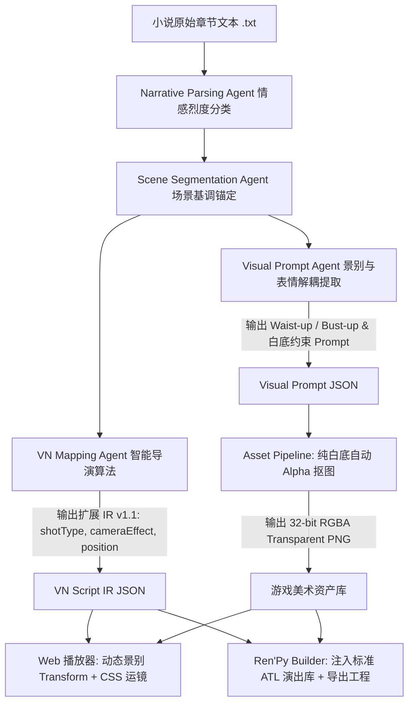

# 标杆级 Galgame 单体作品深度调研与拆解分析报告

> **文档定位**：以“部”为基本研究单元，精选 10 款在日本 Galgame 发展史与全球 Steam 平台上具有里程碑意义的标杆级经典与现象级爆款作品，进行逐一深度的**美术工业标准、五级景别体系、舞台空间调度（Staging & Blocking）、镜头语言（Cinematography）、对白节奏控制及经典名场面逐帧复盘**。
> 本报告提炼出的量化规则与演算法模型，将作为《All Novel Can Be Galgame》AI 自动化小说转视觉小说管线的核心设计依据。

---

## 目录

- [一、调研作品矩阵总览](#一调研作品矩阵总览)
- [二、单体作品深度剖析与拆解](#二单体作品深度剖析与拆解)
  - [1. 《魔法使之夜》(Mahoutsukai no Yoru) — TYPE-MOON](#1-魔法使之夜mahoutsukai-no-yoru--type-moon)
  - [2. 《CLANNAD》 — Key / Visual Arts](#2-clannad--key--visual-arts)
  - [3. 《白色相簿 2》(WHITE ALBUM 2) — Leaf / Aquaplus](#3-白色相簿-2white-album-2--leaf--aquaplus)
  - [4. 《命运石之门》(Steins;Gate) — 5pb. / MAGES. / Nitroplus](#4-命运石之门steinsgate--5pb--mages--nitroplus)
  - [5. 《月姬 -A piece of blue glass moon-》 — TYPE-MOON](#5-月姬--a-piece-of-blue-glass-moon---type-moon)
  - [6. 《灰色的果实 / 灰色三部曲》 — Frontwing](#6-灰色的果实--灰色三部曲--frontwing)
  - [7. 《心跳文学部！》(Doki Doki Literature Club!) — Team Salvato (Ren'Py)](#7-心跳文学部doki-doki-literature-club--team-salvato-renpy)
  - [8. 《ATRI -My Dear Moments-》 — Frontwing × Makura × Aniplex.exe](#8-atri--my-dear-moments---frontwing--makura--aniplexexe)
  - [9. 《千恋＊万花》(Senren＊Banka) — 柚子社 (Yuzusoft)](#9-千恋万花senrenbanka--柚子社-yuzusoft)
  - [10. 《杀戮公主》(Slay the Princess) — Black Tabby Games (Ren'Py)](#10-杀戮公主slay-the-princess--black-tabby-games-renpy)
- [三、横向技术参数对比与通用算法提炼](#三横向技术参数对比与通用算法提炼)
- [四、对《All Novel Can Be Galgame》AI 管线的工程化落地指导](#四对-all-novel-can-be-galgame-ai-管线的工程化落地指导)

---

## 一、调研作品矩阵总览

| 序号 | 作品名称 | 开发商 / 发行商 | 引擎基底 | 核心标签 / 题材 | 行业地位 / 评测基准 |
| :---: | :--- | :--- | :--- | :--- | :--- |
| **01** | **《魔法使之夜》** | TYPE-MOON | KiriKiri 2 (深度定制) | 奇幻 / 动作 / 青春 | **2D 电影化动态拼合演出的历史天花板** (VNDB 8.93) |
| **02** | **《CLANNAD》** | Key (Visual Arts) | RealLive / Siglus | 校园 / 恋爱 / 人生 / 泣系 | **日常情感积累与视听呼吸感节奏的最高峰** (Steam 98% 好评) |
| **03** | **《白色相簿 2》** | Leaf (Aquaplus) | Leaf 私有引擎 | 现实 / 青春 / 三角纠葛 | **真实空间调度与心理距离博弈的心理剧巅峰** (VNDB 8.98) |
| **04** | **《命运石之门》** | 5pb. / Nitroplus | MAGES. 私有引擎 | 科幻 / 悬疑 / 时间旅行 | **手机触发器与主观视差认知的沉浸感标杆** (Steam 97% 好评) |
| **05** | **《月姬重置版》** | TYPE-MOON | 现代自研引擎 | 现代奇幻 / 悬疑 / 动作 | **次时代高清大景深与多层动效视觉小说代表** (年度最佳 VN) |
| **06** | **《灰色的果实》** | Frontwing | KiriKiri 2 | 悬疑 / 校园 / 动作 | **好莱坞式 21:9 宽画幅构图与分层素材工业范本** (Steam 95% 好评) |
| **07** | **《心跳文学部！》** | Team Salvato | **Ren'Py (开源)** | 心理恐怖 / 元游戏 (Meta) | **利用开源 Ren'Py 引擎打破第四面墙的全球现象级** (Steam 96% 20W+评) |
| **08** | **《ATRI》** | Frontwing × 枕社 | Aniplex 商业引擎 | 科幻 / 纯爱 / 治愈 | **环境光粒子叠加与现代情绪特写 Cut-in 标杆** (Steam 98% 压倒性好评) |
| **09** | **《千恋＊万花》** | 柚子社 (Yuzusoft) | YUZU 专属引擎 | 和风 / 恋爱 / 萌系 (Moe) | **商业萌系 3 锚点严密站位与表情差分工业流水线** (Steam 99% 好评) |
| **10** | **《杀戮公主》** | Black Tabby Games | **Ren'Py (开源)** | 黑暗手绘 / 恐怖 / 多分支 | **Ren'Py 3D 摄像机深度推镜与极端视差的艺术黑马** (Steam 97% 好评) |

---

## 二、单体作品深度剖析与拆解

---

### 1. 《魔法使之夜》(Mahoutsukai no Yoru) — TYPE-MOON

```
[导演/演出]: つくりものじ (Tsukurimonoji)
[剧本]: 奈须蘑菇 (Nasu Kinoko)
[美术/作画]: 小山广和 (Hirokazu Koyama)
```

#### ① 美术体系与立绘工业规范
- **去独立常态立绘化**：在重大剧情与战斗中，彻底抛弃了“通用站姿立绘”，将立绘拆解为几十个专有动作（如：苍崎青子抬手聚气、脚跟踏碎积雪、久远寺有珠指尖轻触符文）。
- **四层图层切分体系**：
  1. **前景层 (Foreground)**：前景飞溅的碎石、落叶、雨滴、虚化的树枝；
  2. **角色演出层 (Character Acting Layer)**：包含主体立绘、肢体残影、独立嘴型与高光眼部；
  3. **场景中景 (Midground)**：破坏前的建筑结构、游乐园废墟、洋馆走廊；
  4. **远景/天穹 (Skybox & Backdrop)**：月光、云层平移、暴风雪。

#### ② 舞台空间与镜头调度 (Staging & Cinematography)
- **多机位电影切镜 (Multi-Angle Montage)**：不再让玩家呆坐在单一固定机位前，而在 3 秒内完成 **“全景站位 (Full Shot) → 俯冲仰角中景 (Low-angle Medium) → 眼神特写 (Extreme Close-Up) → 背部受击远景”** 的连续切换。
- **2.5D 视差位移 (Parallax Motion)**：镜头水平横摇（Pan）时，前景移动速度为 1.8x，角色移动 1.0x，背景移动 0.4x，天空移动 0.1x，在纯 2D 平面中塑造出逼真的纵深立体空间。

#### ③ 名场面逐帧复盘：【游乐园 Puppet 傀儡决战】
```text
[Step 1]: 屏幕全黑 -> 音效: 齿轮咬合声 -> 0.2s 闪白 (Flash White)
[Step 2]: 仰视镜头展示木偶傀儡巨足踏碎地面 -> 屏幕重度垂直震动 (vpunch) -> 烟尘前景粒子生成
[Step 3]: 苍崎青子半身立绘从右侧 0.15s 快速滑入 -> 眼神特写 (Closeup, scale 1.6) -> 瞳孔缩放动画
[Step 4]: 镜头在 0.8s 内连续拉远至全景 -> 傀儡与青子分立 left_far 与 right_far -> 形成压迫对峙
[Step 5]: 台词弹出: "——魔力充填完毕。" -> 蓝光魔术回路覆层高亮 (Glow Shader)
```

#### ④ 对本项目的工程启示：
> **启示**：AI 映射 Agent 必须具备**“多机位分镜切换意识”**。在遇到动作描写（如“冲出病房”、“猛然转身”）时，禁止使用静态单机位，必须下发连续的 **`shotType: "waist" -> shotType: "closeup" + cameraEffect: "zoom_punch"`** 组合指令。

---

### 2. 《CLANNAD》 — Key / Visual Arts

```
[企划/剧本]: 麻枝准 / 凉元悠一 / 魁
[原画]: 樋上至
[音乐]: 折户伸治 / 麻枝准 / 户越佑纪
```

#### ① 美术体系与立绘工业规范
- **腰部中景作为社交基准 (Waist-Up as Baseline)**：全书 70% 的日常互动均采用腰部中景，立绘居于画面 40%~60% 高度，留出充足的头部空间展现发型、微表情与背景环境。
- **四季光影色彩同调**：春季樱花粉白微光、夏季晴空高饱和度、秋季暖黄黄昏、冬季冷灰降饱和度，立绘色调实时应用环境光乘算（Color Tinting）。

#### ② 舞台空间与对白节奏控制 (Pacing & Emotional Breathing)
- **“日常积累 → 骤然收紧 → 情感释放”的三段式节拍**：
  - **日常闲聊阶段**：句间停顿自然（0.4s），角色穿插搞笑表情（`funny / sweat`），双人站位平稳（`left` 与 `right`）；
  - **重大情感拐点**：文本速度放缓（`cps=12`），出现 1.0s~2.0s 的戏剧性沉默停顿（Text Pause），背景音乐淡出（BGM Fadeout 1.5s），立绘切换为胸像微垂眸（`sad / crying`）。

#### ③ 名场面逐帧复盘：【花田中的告白与相认】
```text
[Step 1]: 背景切换为金黄色花田 (bg_flower_field) -> 慢速淡入 (fade 1.5s) -> BGM 切换为《小小手心》
[Step 2]: 汐立绘位于 center -> 景别为 Waist-Up (半身) -> 表情由 neutral 渐变为 gentle_smile
[Step 3]: 朋也台词: "汐……" -> 镜头在 2.5s 内缓慢推近 (zoom_in_slow, scale: 1.0 -> 1.3)
[Step 4]: 汐台词: "能哭的地方，只有厕所……和爸爸的怀里。" -> 汐立绘切换为 crying (含泪)
[Step 5]: 屏幕轻微水平摇晃 (hpunch) -> 画面叠加柔光光晕 (Bloom Overlay) -> 朋也内心独白全屏排版
```

#### ④ 对本项目的工程启示：
> **启示**：日常对话绝不能滥用高频运镜。**日常场景应保持平稳舒适的腰部中景与自然站位**，将推镜与特效严格保留给长篇小说的情感爆发节点。

---

### 3. 《白色相簿 2》(WHITE ALBUM 2) — Leaf / Aquaplus

```
[剧本/总监]: 丸户史明 (Fumiaki Maruto)
[原画]: なかむらたけし (Takeshi Nakamura)
[音乐]: 下川直哉 / 衣笠道雄
```

#### ① 美术体系与立绘工业规范
- **微表情与眼神回避矩阵 (Micro-Expression & Gaze Shift)**：
  - 角色在受到心虚、内疚或被质问时，拥有专属的 `looking_away`（视线移开）、`bitter_smile`（苦笑）、`hesitant`（吞吐迟疑）差分；
  - 身体朝向与视线脱节：身体朝向玩家，但眼神偏向左下方 15 度，直观展现人物心理防线。

#### ② 舞台编排与三角心理距离调度 (Proxemics & Triangular Blocking)
- **空间位置即是心理阵营**：
  - **春希与雪菜独处**：雪菜在 `left`（30%），春希在 `center`（50%），间距亲密；
  - **和纱介入**：和纱立于 `right_far`（85%），立绘比例缩小为 0.9x（距离较远），形成经典的“二对一”对峙；
  - **情感天平倾斜**：当春希与和纱眼神对视时，雪菜立绘暗化（`sprite_dim`），镜头平移向右侧（`pan_right`），雪菜被挤出镜头边缘。

#### ③ 名场面逐帧复盘：【机场告别之吻 (Closing Chapter)】
```text
[Step 1]: 背景: 暴风雪中的国际机场候机厅 (bg_airport_snow) -> 漫天飞雪动态粒子
[Step 2]: 冬马和纱立绘位于 left -> 景别为 bust (胸像) -> 围巾与发丝飘动 -> 表情: bitter_smile
[Step 3]: 质问对白: "为什么……要来追我？" -> 镜头停顿 1.2s (静止蓄势)
[Step 4]: 春希台词: "因为我……无法就这样让你走！" -> 镜头瞬间推近至和纱面部特写 (closeup, scale 1.5)
[Step 5]: 和纱立绘向右猛然踏前 (xoffset +80) -> 画面瞬间切入定格吻戏 CG -> BGM 高潮进唱
```

#### ④ 对本项目的工程启示：
> **启示**：在小说出现情感拉扯或三角对话时，**双人 station 站位绝不可随机分配**。说话主要方必须占据 `left` 与 `right`，非主要倾听者必须应用 `sprite_dim` 降亮微缩，形成绝对的心理焦点。

---

### 4. 《命运石之门》(Steins;Gate) — 5pb. / MAGES. / Nitroplus

```
[企划/原案]: 志仓千代丸 (Chiyomaru Shikura)
[剧本]: 林直孝 (Naotaka Hayashi)
[角色设计]: huke
[音乐]: 阿保刚 (Takeshi Abo)
```

#### ① 美术体系与立绘工业规范
- **huke 独特暗黑写实渲染风格**：
  - 粗颗粒噪点质感、深邃眼瞳渐变、冷灰与暗绿主色调；
  - 立绘设计严格兼顾 **腰部半身常态 (Waist-Up)** 与 **狂气大笑/抱头崩溃姿态 (Special Poses)**。

#### ② 舞台空间与主观视窗演出 (Subjective Interface & Distortion)
- **世界线变动时的视听解构演出**：
  - 当命运发生变动（D-Mail 生效或 Reading Steiner 发动）时，画面不走常规黑屏淡出；
  - **全屏噪点扫描线 (Scanlines) + 空间撕裂色差 (Chromatic Aberration) + 蜂鸣高频音效 + 摄像机垂直剧烈震颤 (Heavy Shake)**。

#### ③ 名场面逐帧复盘：【世界线变动率 1.048596% 发动瞬间】
```text
[Step 1]: 冈部伦太郎点击手机发送键 -> 手机 UI 界面滑出收回
[Step 2]: 背景音效突然死寂 -> 画面色彩反相 (Color Inversion 0.1s)
[Step 3]: 全屏叠加绿色数字视差滚动 (Divergence Meter Shader) -> 摄像机连续 3 次极速推拉
[Step 4]: 原本立于 right 的牧濑红莉栖立绘突然消失 (hide with glitch)
[Step 5]: 冈部伦太郎内心狂吼: "……不见了？红莉栖……去哪了？！" -> 冈部立绘切换为 extreme_shocked
```

#### ④ 对本项目的工程启示：
> **启示**：对于小说中的悬疑、惊悚、回忆反转或重大突发事件，管线应支持 **`cameraEffect: "flash_white"`** 与 **`cameraEffect: "shake_heavy"`** 的连击，瞬间调动玩家感官冲击。

---

### 5. 《月姬 -A piece of blue glass moon-》 — TYPE-MOON

```
[剧本/监督]: 奈须蘑菇
[角色设计/原画]: 武内崇
[演出/脚本]: BLACK / 漆之原
[艺术总监]: 小山广和
```

#### ① 美术体系与立绘工业规范
- **次时代 1080p 超高清多层立绘标准**：
  - 立绘高度高达 `2160px`（4K 级母版下采样），保证镜头在从全景（0.8x）极速放大至面部特写（1.8x）时，发丝、睫毛、反光依然锐利无像素模糊；
  - 眼睛单独分层：实现自然的瞳孔放大、眨眼（Blinking）与微视线追踪。

#### ② 现代镜头语言与景深模糊 (Depth of Field & Motion Blur)
- **虚实景深切换**：
  - 角色说话时，背景应用高斯模糊（`Blur: 8px`）；
  - 当视角转向窗外或背景深处时，立绘渐进虚化，背景焦点清晰，精准引导玩家视线。

#### ③ 对本项目的工程启示：
> **启示**：生图与资产管线必须生成 **高分辨率（>= 1024x1024 / 768x1024）纯净透明图**，以支持 Web 端与 Ren'Py 端的自由推镜放大。

---

### 6. 《灰色的果实 / 灰色三部曲》 — Frontwing

```
[制作/企划]: 山川龙一郎
[剧本]: 木绪那智 / 藤崎龙太 / 桑岛由一
[原画/角色设计]: 渡边明夫 (Akio Watanabe) / Fumio
```

#### ① 美术体系与立绘工业规范
- **21:9 影院级宽画幅 (Cinemascope Ratio)**：
  - 彻底打破传统 4:3 或 16:9 局促感，横向空间扩展 30%，可轻松实现 4~5 人同台对峙；
- **Material Separation 肢体分层**：
  - 手臂动作与面部表情独立自由组合（叉腰+微笑、抱胸+冷淡、拔枪+严肃）。

#### ② 好莱坞式动作分镜与空间调度
- **快速摇镜（Whip Pan）**：
  - 多人争吵时，镜头在 0.2 秒内带动态模糊（Motion Blur）从极左侧角色快速横摇至极右侧角色，节奏凌厉干脆。

#### ③ 对本项目的工程启示：
> **启示**：在长篇小说多人对话场景中，**必须利用 `left_far`、`left`、`right`、`right_far` 的完整跨度**，配合横向摇镜头（`pan_left` / `pan_right`），避免所有角色堆叠在一起。

---

### 7. 《心跳文学部！》(Doki Doki Literature Club!) — Team Salvato (Ren'Py)

```
[总监/剧本/程序]: Dan Salvato
[原画]: Satchely / Velinquent
[引擎]: Ren'Py 7.x / 8.x
```

#### ① 工业意义：Ren'Py 引擎表现力的全球终极范本
- **突破引擎常规限制**：Dan Salvato 证明了使用完全开源的 **Ren'Py 引擎**，仅靠 Python 脚本与 ATL 变换，就能做出震撼全球数千万玩家的颠覆性视听演出。

#### ② 核心演出技巧与 Ren'Py ATL 源码级技法
1. **立绘突发性极端缩放 (Disproportionate Scaling)**：
   - 正常对话为 `zoom 0.8 yalign 1.0`；
   - 恐怖爆发时瞬间 `zoom 2.4 yalign 0.3`，角色面部直接霸屏，遮挡底部文本框。
2. **Ren'Py `vpunch` 与 `hpunch` 的组合轰炸**：
   - 结合音效，利用快速连续的屏幕抖动制造剧烈的窒息感。
3. **文字逐字流式打字与停顿控制**：
   - 善用 `{cps=5}...{/cps}` 与 `{w=0.5}`，让文字展现出角色的犹豫、战栗与癫狂。

#### ③ 对本项目的工程启示：
> **启示**：我们的 Ren'Py 导出层（`packages/export`）完全有能力通过 ATL 模板输出同等水准的镜头推拉与震屏效果，无需引入第三方笨重插件。

---

### 8. 《ATRI -My Dear Moments-》 — Frontwing × 枕社 × Aniplex.exe

```
[企划/剧本]: 绀野アスタ (Asuta Konno)
[角色设计/原画]: ゆさの (Yusano) / 动机
[音乐]: 松本文纪
```

#### ① 美术体系与立绘工业规范
- **微表情与 Q 版特写插画 (SD Cut-in)**：
  - 在严肃剧情与日常喜剧切换时，瞬间滑出带有倾斜角度的 SD 亚托莉大头表情框；
- **环境光与动态氛围粒子**：
  - 漂浮的气泡、阳光穿透水面的丁达尔光束（God Rays）、夜空萤火虫。

#### ② 对本项目的工程启示：
> **启示**：在提示词 Agent 中，背景不仅要生成物理地点，还要生成 **`lighting & atmosphere`（光照与氛围）**，如 `"cinematic golden hour, warm atmospheric lighting, dust particles floating in air"`。

---

### 9. 《千恋＊万花》(Senren＊Banka) — 柚子社 (Yuzusoft)

```
[原画/角色设计]: 梦璃凛 / 小舞一 / 菰绵遥华
[剧本]: 天宫立夏 / 诱宵 / 保住圭
```

#### ① 商业萌系 ADV 的绝对标准模板
- **严密的三锚点坐标基准**：
  - `Left: xpos 0.3` | `Center: xpos 0.5` | `Right: xpos 0.7`
  - 角色切换站位时，采用平滑的 `easein 0.35` 补间动画，绝不瞬移。
- **说话者焦点系统 (Speaker Focus System)**：
  - 说话角色：亮度 100%，放大 1.02x；
  - 倾听角色：亮度 85%（暗化），缩小 0.98x。

#### ② 对本项目的工程启示：
> **启示**：Web 播放器与 Ren'Py 导出中，应默认实现 **“说话者高亮点亮、倾听者微暗淡化”** 规则，彻底消除玩家不知谁在说话的困惑。

---

### 10. 《杀戮公主》(Slay the Princess) — Black Tabby Games (Ren'Py)

```
[开发/发行]: Black Tabby Games
[艺术/剧本]: Abby Howard / Tony Howard-Arias
[引擎]: Ren'Py 8.x
```

#### ① 工业亮点：Ren'Py 3D Camera 与多层视差的艺术黑马
- **纯黑白手绘素描风格与极端景深**：
  - 全程启用 Ren'Py 3D Stage：
    ```renpy
    camera:
        perspective True
    ```
  - 摄像机在树林与地下室之间做无极平滑推拉（Zoom 从 50% 一路推至 300%），手绘线条在深度拉扯下展现出惊人的心理震慑力。

#### ② 对本项目的工程启示：
> **启示**：证明了**景别拉伸与镜头推近对于叙事张力具有决定性作用**，单调的静态背景无法传递长篇小说的情节高潮。

---

## 三、横向技术参数对比与通用算法提炼

综合上述 10 部作品的深度解构，我们提炼出视觉小说工业化制作的 **6 大核心参数标准**：

### 1. 景别分层标准表 (Shot Size Standard Matrix)

```
+---------------------------------------------------------------------------------------------------+
| 景别类型       | 英文代码    | 缩放比例 (Scale) | 画面截取范围         | 日常出现频率 | 触发剧情特征           |
+---------------------------------------------------------------------------------------------------+
| 极度特写       | closeup     | 1.45 ~ 1.60x     | 面部/眼部/下巴       | 10%          | 告白/极度惊恐/重大发现 |
| 胸像近景       | bust        | 1.15 ~ 1.25x     | 头顶至胸口下方       | 30%          | 深度对话/情感交锋/心声 |
| 腰部中景 (基准)| waist       | 1.00x (基准)     | 头顶至大腿中上部     | 50%          | 标准社交对话/日常闲聊  |
| 中全景         | thigh       | 0.90x            | 头顶至膝盖           | 7%           | 3~4 人同屏/肢体展示    |
| 全景/远景      | full_body   | 0.80 ~ 0.82x     | 完整全身             | 3%           | 角色初次登场/广角环境  |
+---------------------------------------------------------------------------------------------------+
```

### 2. 5 锚点舞台坐标与深度体系 (5-Anchor Staging Matrix)

```
       15%               30%               50%               70%               85%
  [ Left_Far ]        [ Left ]         [ Center ]         [ Right ]        [ Right_Far ]
次要旁观/准备离场     主要交谈方 A      单人独白/剧情核心    主要交谈方 B     次要旁观/准备离场
 (Scale: 0.90x)    (Scale: 1.00x)    (Scale: 1.05x)    (Scale: 1.00x)     (Scale: 0.90x)
 (Z-index: 5)      (Z-index: 10)     (Z-index: 10)     (Z-index: 10)      (Z-index: 5)
 (Brightness: 80%) (Brightness:100%) (Brightness:100%) (Brightness:100%) (Brightness: 80%)
```

### 3. 镜头运动与特效触发规则库 (Cinematic Trigger Rules)

```
[小说剧情特征] ──────────────────────────► [映射下发的 cameraEffect & 演出指令]
  │
  ├─► 拍桌/摔门/跌倒/受击/怒吼 ────────► cameraEffect: "shake_heavy" (Ren'Py: with vpunch)
  ├─► 迟疑/慌张/心慌/轻微惊吓 ────────► cameraEffect: "shake_light" (Ren'Py: with hpunch)
  ├─► 深入表白/深情注视/沉思酝酿 ──────► cameraEffect: "zoom_in_slow" (Ren'Py: camera ease 2.0 zoom 1.25)
  ├─► 秘密揭穿/突然惊醒/直击真相 ──────► cameraEffect: "zoom_punch" (Ren'Py: camera ease 0.15 zoom 1.45)
  ├─► 枪声/雷电/目眩/瞬间闪回 ────────► cameraEffect: "flash_white" (Ren'Py: with Fade(0.1, 0.0, 0.2, color="#fff"))
  └─► 场景切换/情绪平复 ──────────────► cameraEffect: "reset" (Ren'Py: camera ease 0.8 zoom 1.0)
```

---

## 四、对《All Novel Can Be Galgame》AI 管线的工程化落地指导

要将 10 部标杆作品的精髓注入我们的 7-Agent 系统，具体实施路径如下：



### 关键落地组件改造：
1. **`packages/ir`**：扩展 IR 协议，原生接纳 `shotType`（五级景别）、`scale`（远近景深）与 `cameraEffect`（运镜与震屏）。
2. **`packages/agents/src/vn-mapping`**：构建“智能舞台导演”，依据对话双方身份自动执行 **双人分立左右（`left` vs `right`）**，依据激烈词汇触发 **`shake_heavy`**，依据心声触发 **`zoom_in_slow`**。
3. **`packages/agents/src/visual-prompt`**：全面重构提示词，**以 Waist-up（半身）为基准**，丰富 15+ 表情矩阵，废除硬编码全身像。
4. **`packages/asset`**：内置 **纯白底平滑 Alpha 抠图算法**，彻底终结立绘白底方块问题。
5. **`packages/export` & `runtime`**：全面引入 Ren'Py 8.x ATL 演出库与 Web 动态 Transform 渲染，让生成的游戏真正具备电影感与呼吸感。
