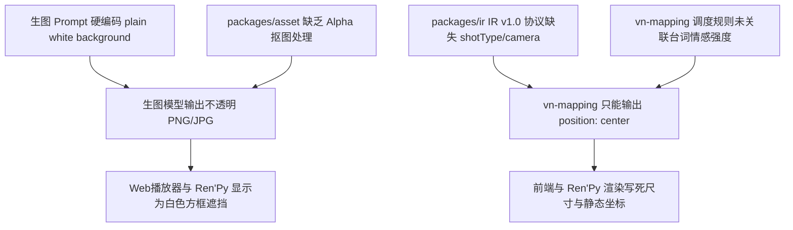

# 视觉表现与舞台演出问题诊断报告 (2026-08-22)

> **文档定位**：对当前《All Novel Can Be Galgame》项目在第二轮真实测试中暴露出的**视觉表现力僵化、立绘白底方块遮挡、景别单一、缺乏舞台调度与镜头语言**等核心问题进行深度诊断，明确问题现象、根因机理与代码修改定位。

---

## 一、核心问题现象汇总

在第二轮 7 本小说（298 章节）的全量真实生成测试中，虽然文本保留率与 RAG 基础人设提取已跑通，但在视觉小说（Galgame）游戏实际游玩体验上，暴露出以下严重缺陷：

| 缺陷分类 | 具体表现现象 | 用户感知体验 |
| :--- | :--- | :--- |
| **1. 立绘白底方块** | 生成的人物立绘四周带有**不透明的纯白矩形背景**，立绘直接以白底大方块形式叠加在场景背景图之上。 | 严重遮挡场景背景，画面极其割裂粗糙，完全无法达到正常 Galgame 透明立绘标准。 |
| **2. 景别单一（死板全身像）** | 所有角色立绘无论在日常对话、私密耳语还是激烈争吵，全被固定为从头到脚的**全身站立姿态（Full-Body Standing）**。 | 人物在画面中显得极小，五官表情看不清，缺乏 Galgame 核心的半身像（Waist-up）与胸像（Bust-up）视觉张力。 |
| **3. 舞台调度与站位僵死** | 90% 以上的角色登场与对话步骤都被简单置于屏幕正中央（`position: "center"`），双人或多人对话时角色相互重叠或无序居中。 | 缺乏角色走位与空间关系，玩家无法通过站位感知说话人之间的物理距离与心理距离。 |
| **4. 镜头语言（Cinematography）缺失** | 整个剧本从头到尾只有静态背景和立绘硬切，没有镜头推近（Zoom-in）、拉远（Zoom-out）、平移（Pan）、震屏（Shake）或闪白（Flash）。 | 激烈冲突（如摔门、争辩、车祸）或内心独白毫无视听冲击力，体验如同“有图的 PPT 翻页”。 |
| **5. 背景模板化与视角固定** | 背景提示词一律被拼接 `wide angle shot`（广角远景），缺少近景与特殊视点景物。 | 无法展现室内特写（如书桌、信件、门缝、窗外雨夜），场景沉浸感不足。 |

---

## 二、深度技术根因剖析（Root Cause Analysis）



### 1. 立绘白底与生图模板硬编码根因
- **代码现场 1**：`packages/agents/src/visual-prompt/visual-prompt-agent.ts` (L47, L67)
  ```typescript
  // 提示词硬编码了全身立正与白底：
  `Japanese visual novel character sprite, 2D anime game art, solo character, full body standing pose, plain white solid background, clean cutout, cel shading, crisp lineart, [character details], high quality`
  ```
- **代码现场 2**：`packages/asset/src/agnes-producer.ts` (L67)
  ```typescript
  const charBase = `solo character, full body standing pose, plain white solid background, clean cutout, 2D visual novel character sprite, ${neutralQuality}`;
  ```
- **关键缺失**：AI 生图接口（Agnes Image / Flux / SD）输出的 `b64_json` 是 RGB 三通道普通图像，带有真实的白色像素。`packages/asset` 在落盘保存时未进行任何 **Alpha 通道提取 / 自动抠图（Transparent Cutout）** 处理，导致白底直接进入资产库。

### 2. 景别（Shot Type）与角色姿态层级缺失
- **缺乏工业化立绘分层**：Galgame 行业标准以 **腰部中景（Waist-up）** 为社交基准，以 **胸像近景（Bust-up）** 强化表情情绪，而当前代码将所有角色都强行锁在 `full body standing pose`。
- **缺乏表情差分（Expression Sheets）**：提示词中虽然生成了 `expression`，但由于全身像头部占比极小（不足画面高 15%），表情变化在屏幕上几乎难以察觉。

### 3. IR 协议与舞台调度数据结构瓶颈
- **代码现场 3**：`packages/ir/src/schema.ts` (L19-L26)
  ```typescript
  export const ShowStepSchema = z.object({
    ...BaseStepFields,
    type: z.literal("show"),
    characterId: z.string(),
    expression: z.string().optional(),
    position: z.enum(["left_far", "left", "center", "right", "right_far"]).optional(),
  });
  ```
- **协议局限**：
  - 没有 `shotType` 字段（无法区分特写/中景/全身）；
  - 没有 `scale` / `depth` 字段（无法表现前排/后排景深关系）；
  - 没有 `cameraEffect` 字段（无法在 IR 层面下达推镜头、震屏、晃动指令）。
- **映射规则粗糙**：`packages/agents/src/vn-mapping/vn-mapping-agent.ts` 没有情感强度与对白类型的分析，无法智能识别“争执”、“耳语”、“惊讶”、“回忆”，导致几乎所有台词步骤都采用相同平淡的站位策略。

### 4. 渲染呈现层（Web Runtime & Ren'Py Export）实现僵化
- **Web 播放器现场**：`apps/workbench/src/pages/PreviewPage.tsx` (L258)
  ```tsx
  // 尺寸写死，无法根据景别缩放
  style={{ width: '22%', maxWidth: '260px', height: '70%' }}
  ```
- **Ren'Py 导出层现场**：`packages/export/src/renpy/script-generator.ts` (L112)
  ```renpy
  # 仅仅是简单的 show id at pos, character_display，无 ATL 动画与运镜
  show id expr at pos, character_display with dissolve
  ```

---

## 三、问题定位与改造优先级清单

| 优化模块 | 涉及核心文件 | 改进关键内容 | 优先级 |
| :--- | :--- | :--- | :---: |
| **资产透明化** | `packages/asset/src/agnes-producer.ts`<br>`packages/asset/src/extractor.ts` | 引入纯白底转 Alpha 透明通道处理算法，输出干净透明的 PNG 立绘。 | **P0** |
| **提示词与景别解耦** | `packages/agents/src/visual-prompt/visual-prompt-agent.ts` | 废除硬编码全身像，默认采用 Galgame 标准半身像（waist-up/bust-up），丰富表情与姿态提示词。 | **P0** |
| **IR 协议扩展 (v1.1)** | `packages/ir/src/schema.ts`<br>`packages/ir/src/types.ts` | 扩展 `ShowStep`（增加 `shotType`, `scale`）与 `TransitionStep`（增加 `cameraEffect`）。 | **P0** |
| **智能舞台调度** | `packages/agents/src/vn-mapping/vn-mapping-agent.ts` | 根据台词情绪、对白关系自动生成双人站位、特写推镜与震屏指令。 | **P1** |
| **Web 播放器升级** | `apps/workbench/src/pages/PreviewPage.tsx`<br>`packages/runtime/` | 支持不同景别缩放渲染、透明 PNG 叠加与 CSS 镜头动效（震屏/推拉）。 | **P1** |
| **Ren'Py ATL 导出** | `packages/export/src/renpy/templates.ts`<br>`packages/export/src/renpy/script-generator.ts` | 导出 Ren'Py 专用 ATL Transforms（`sprite_bust`, `sprite_closeup`, `vpunch/hpunch` 运镜）。 | **P1** |
